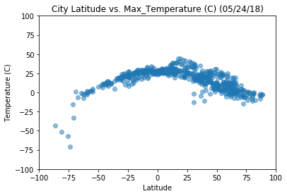
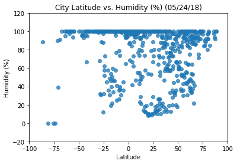
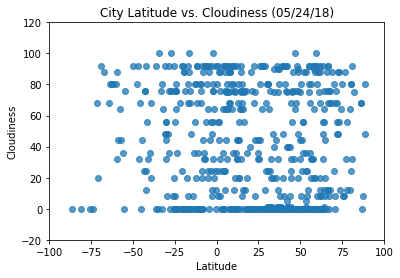
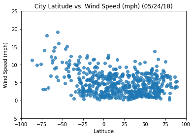

Analysis:
1) Temperatures tend to drop the further the cities are from zero (0) latitude, or the earth's equator. 
2) Variability in humidity appears to be higher for cities between -25 to +60 latitude.
3) Wind speed appears to be higher for cities in the south of the equator beginning -25.


```python
# Dependencies
import csv
import numpy as np
import pandas as pd
import matplotlib.pyplot as plt
import seaborn as sns
from citipy import citipy
import requests
import time
from math import sqrt
from datetime import datetime
from config import api_key
```

Generate Cities List


```python
# Data frame for randomly generated lat and long
geo_data = pd.DataFrame()
geo_data['lat'] = [np.random.uniform(-90,90) for x in range(1300)]
geo_data['lng'] = [np.random.uniform(-180, 180) for x in range(1300)]

# Add City Name 
geo_data['city'] = ""
geo_data['country'] = ""

#find and add closest city and country code
for index, row in geo_data.iterrows():
    lat = row['lat']
    lng = row['lng']
    geo_data.loc[index, 'city'] = citipy.nearest_city(lat, lng).city_name
    geo_data.loc[index, 'country'] = citipy.nearest_city(lat, lng).country_code
    
geo_data.head()
```


<div>
<style scoped>
    .dataframe tbody tr th:only-of-type {
        vertical-align: middle;
    }

    .dataframe tbody tr th {
        vertical-align: top;
    }

    .dataframe thead th {
        text-align: right;
    }
</style>
<table border="1" class="dataframe">
  <thead>
    <tr style="text-align: right;">
      <th></th>
      <th>lat</th>
      <th>lng</th>
      <th>city</th>
      <th>country</th>
    </tr>
  </thead>
  <tbody>
    <tr>
      <th>0</th>
      <td>-55.139302</td>
      <td>-136.533265</td>
      <td>rikitea</td>
      <td>pf</td>
    </tr>
    <tr>
      <th>1</th>
      <td>70.318332</td>
      <td>61.410120</td>
      <td>amderma</td>
      <td>ru</td>
    </tr>
    <tr>
      <th>2</th>
      <td>5.133420</td>
      <td>30.441532</td>
      <td>maridi</td>
      <td>sd</td>
    </tr>
    <tr>
      <th>3</th>
      <td>-64.390516</td>
      <td>-85.672671</td>
      <td>punta arenas</td>
      <td>cl</td>
    </tr>
    <tr>
      <th>4</th>
      <td>55.023850</td>
      <td>-94.490850</td>
      <td>thompson</td>
      <td>ca</td>
    </tr>
  </tbody>
</table>
</div>


```python
# delete repeated cities and find unique city count
geo_data = geo_data.drop_duplicates(['city'])
geo_data = geo_data.dropna()
len(geo_data['city'].value_counts())
```


    566


Perform API Calls


```python
geo_data.dtypes
```


    lat        float64
    lng        float64
    city        object
    country     object
    dtype: object


```python
#Counter

row_count = 0

# loop through and get the weather data using Open Weather API

for index, row in geo_data.iterrows():
    
    #Sleep to help with the call limit
    
    time.sleep(1)
    
     #Open weather url.
    
    url = "https://api.openweathermap.org/data/2.5/weather?"
    units = "metric"
    
    query_url = url + "lat="+ str(row["lat"]) + "&lon=" + str(row["lng"]) + "&appid=" + api_key + "&units=" + units
   
# Print log to ensure the loop is working correctly.
    
    print("Now retieving city # " + str(row_count))
    print(query_url)
    row_count += 1
    
    #Run requests to grab the JSON at the requested URL
    
    city_weather = requests.get(query_url).json()
    
#     #Append geo_data to the appropriate columns.
#     #Use try/except to skip any cities with errors.
#     selected_cities.append(requests.get(query_url + str(city_weather)).json())
    try:
        temperature = city_weather["main"]["temp_max"]
        humidity = city_weather["main"]["humidity"]
        cloudiness = city_weather["clouds"]["all"]
        wind_speed = city_weather["wind"]["speed"]
        date = city_weather["dt"]
        
        geo_data.loc[index, "Max_Temp"] = temperature
        geo_data.loc[index,"Humidity"] = humidity
        geo_data.loc[index,"Cloudiness"] = cloudiness
        geo_data.loc[index,"Wind Speed"] = wind_speed
        geo_data.loc[index,"Date"] = date
    except:
        print("Error with weather data, skipping.")

geo_data
```

    Now retieving city # 0
    https://api.openweathermap.org/data/2.5/weather?lat=-55.13930170971912&lon=-136.5332648861989&appid=89bdd3b9bfb31b3b40392aa84e8be35a&units=metric
    Now retieving city # 1
    https://api.openweathermap.org/data/2.5/weather?lat=70.318332304732&lon=61.410120303739205&appid=89bdd3b9bfb31b3b40392aa84e8be35a&units=metric
    Now retieving city # 2
    https://api.openweathermap.org/data/2.5/weather?lat=5.133419547806113&lon=30.44153170851024&appid=89bdd3b9bfb31b3b40392aa84e8be35a&units=metric
    Now retieving city # 3
    https://api.openweathermap.org/data/2.5/weather?lat=-64.39051647489738&lon=-85.67267123994397&appid=89bdd3b9bfb31b3b40392aa84e8be35a&units=metric
    Now retieving city # 4
    https://api.openweathermap.org/data/2.5/weather?lat=55.02385047768854&lon=-94.4908497687694&appid=89bdd3b9bfb31b3b40392aa84e8be35a&units=metric
    Now retieving city # 5
    https://api.openweathermap.org/data/2.5/weather?lat=-39.48872837035843&lon=27.771179617596033&appid=89bdd3b9bfb31b3b40392aa84e8be35a&units=metric
    Now retieving city # 6
    https://api.openweathermap.org/data/2.5/weather?lat=86.48694667403953&lon=-161.68539159924094&appid=89bdd3b9bfb31b3b40392aa84e8be35a&units=metric
    Now retieving city # 7
    https://api.openweathermap.org/data/2.5/weather?lat=-68.91823534453795&lon=-144.90172893305547&appid=89bdd3b9bfb31b3b40392aa84e8be35a&units=metric
    Now retieving city # 8
    https://api.openweathermap.org/data/2.5/weather?lat=86.9215824938745&lon=59.5786916004636&appid=89bdd3b9bfb31b3b40392aa84e8be35a&units=metric
    Now retieving city # 9
    https://api.openweathermap.org/data/2.5/weather?lat=-86.5579035802421&lon=-54.91914901770801&appid=89bdd3b9bfb31b3b40392aa84e8be35a&units=metric
    Now retieving city # 10
    https://api.openweathermap.org/data/2.5/weather?lat=24.698161943761846&lon=28.9836328572095&appid=89bdd3b9bfb31b3b40392aa84e8be35a&units=metric
    Now retieving city # 11
    https://api.openweathermap.org/data/2.5/weather?lat=7.14726363052587&lon=100.057967174711&appid=89bdd3b9bfb31b3b40392aa84e8be35a&units=metric
    Now retieving city # 12
    https://api.openweathermap.org/data/2.5/weather?lat=-27.414098201205427&lon=154.19088851399772&appid=89bdd3b9bfb31b3b40392aa84e8be35a&units=metric
    Now retieving city # 13
    https://api.openweathermap.org/data/2.5/weather?lat=30.613329369555586&lon=94.79336411232458&appid=89bdd3b9bfb31b3b40392aa84e8be35a&units=metric
    Now retieving city # 14
    https://api.openweathermap.org/data/2.5/weather?lat=-46.692982142008475&lon=-77.75733937938352&appid=89bdd3b9bfb31b3b40392aa84e8be35a&units=metric
    Now retieving city # 15
    https://api.openweathermap.org/data/2.5/weather?lat=-36.41079482498713&lon=17.459565457918274&appid=89bdd3b9bfb31b3b40392aa84e8be35a&units=metric
    Now retieving city # 16
    https://api.openweathermap.org/data/2.5/weather?lat=-60.32300581926811&lon=14.336392610745577&appid=89bdd3b9bfb31b3b40392aa84e8be35a&units=metric
    Now retieving city # 17
    https://api.openweathermap.org/data/2.5/weather?lat=-12.21095436287068&lon=-69.43776677253445&appid=89bdd3b9bfb31b3b40392aa84e8be35a&units=metric
    Now retieving city # 18
    https://api.openweathermap.org/data/2.5/weather?lat=27.106389158383024&lon=41.85913409084051&appid=89bdd3b9bfb31b3b40392aa84e8be35a&units=metric
    Now retieving city # 19
    https://api.openweathermap.org/data/2.5/weather?lat=39.26578774733369&lon=74.12128443072234&appid=89bdd3b9bfb31b3b40392aa84e8be35a&units=metric
    Now retieving city # 20
    https://api.openweathermap.org/data/2.5/weather?lat=14.361222895151329&lon=-51.51379889286915&appid=89bdd3b9bfb31b3b40392aa84e8be35a&units=metric
    Now retieving city # 21
    https://api.openweathermap.org/data/2.5/weather?lat=53.670177557367765&lon=-24.687214404082&appid=89bdd3b9bfb31b3b40392aa84e8be35a&units=metric
    Now retieving city # 22
    https://api.openweathermap.org/data/2.5/weather?lat=12.13886180555474&lon=48.60582422375771&appid=89bdd3b9bfb31b3b40392aa84e8be35a&units=metric
    Now retieving city # 23
    https://api.openweathermap.org/data/2.5/weather?lat=87.37375542256015&lon=174.26761115869556&appid=89bdd3b9bfb31b3b40392aa84e8be35a&units=metric
    Now retieving city # 24
    https://api.openweathermap.org/data/2.5/weather?lat=49.91166729198943&lon=-125.8430097612206&appid=89bdd3b9bfb31b3b40392aa84e8be35a&units=metric
    Now retieving city # 25
    https://api.openweathermap.org/data/2.5/weather?lat=-23.761210871851773&lon=-48.10706599896713&appid=89bdd3b9bfb31b3b40392aa84e8be35a&units=metric
    Now retieving city # 26
    https://api.openweathermap.org/data/2.5/weather?lat=-30.194356649404874&lon=-32.82686693691312&appid=89bdd3b9bfb31b3b40392aa84e8be35a&units=metric
    Now retieving city # 27
    https://api.openweathermap.org/data/2.5/weather?lat=64.18767703285906&lon=-56.519441869624174&appid=89bdd3b9bfb31b3b40392aa84e8be35a&units=metric
    Now retieving city # 28
    https://api.openweathermap.org/data/2.5/weather?lat=41.784066918120885&lon=-74.21839844190751&appid=89bdd3b9bfb31b3b40392aa84e8be35a&units=metric
    Now retieving city # 29
    https://api.openweathermap.org/data/2.5/weather?lat=30.81115192722541&lon=104.922131819132&appid=89bdd3b9bfb31b3b40392aa84e8be35a&units=metric
    Now retieving city # 30
    https://api.openweathermap.org/data/2.5/weather?lat=63.319055239263946&lon=92.91481347887395&appid=89bdd3b9bfb31b3b40392aa84e8be35a&units=metric
    Now retieving city # 31
    https://api.openweathermap.org/data/2.5/weather?lat=79.66998613405934&lon=-21.118144192050067&appid=89bdd3b9bfb31b3b40392aa84e8be35a&units=metric
    Now retieving city # 32
    https://api.openweathermap.org/data/2.5/weather?lat=-70.89099794721089&lon=161.76755757286452&appid=89bdd3b9bfb31b3b40392aa84e8be35a&units=metric
    Now retieving city # 33
    https://api.openweathermap.org/data/2.5/weather?lat=-9.909561062323803&lon=66.92698873555011&appid=89bdd3b9bfb31b3b40392aa84e8be35a&units=metric
    Now retieving city # 34
    https://api.openweathermap.org/data/2.5/weather?lat=-17.025974206530208&lon=-82.23739555093874&appid=89bdd3b9bfb31b3b40392aa84e8be35a&units=metric
    Now retieving city # 35
    https://api.openweathermap.org/data/2.5/weather?lat=-55.68034383979464&lon=91.61445817906241&appid=89bdd3b9bfb31b3b40392aa84e8be35a&units=metric
    Now retieving city # 36
    https://api.openweathermap.org/data/2.5/weather?lat=-30.186629449984586&lon=63.930814622946&appid=89bdd3b9bfb31b3b40392aa84e8be35a&units=metric
    Now retieving city # 37
    https://api.openweathermap.org/data/2.5/weather?lat=-29.41660537414026&lon=163.7347666142639&appid=89bdd3b9bfb31b3b40392aa84e8be35a&units=metric
    Now retieving city # 38
    https://api.openweathermap.org/data/2.5/weather?lat=-17.11898331906606&lon=63.374945059361636&appid=89bdd3b9bfb31b3b40392aa84e8be35a&units=metric
    Now retieving city # 39
    https://api.openweathermap.org/data/2.5/weather?lat=9.20573550231532&lon=110.58481621896794&appid=89bdd3b9bfb31b3b40392aa84e8be35a&units=metric
    Now retieving city # 40
    https://api.openweathermap.org/data/2.5/weather?lat=58.942027040401996&lon=-150.7665325006133&appid=89bdd3b9bfb31b3b40392aa84e8be35a&units=metric
    Now retieving city # 41
    https://api.openweathermap.org/data/2.5/weather?lat=65.99661414320994&lon=69.57296963324265&appid=89bdd3b9bfb31b3b40392aa84e8be35a&units=metric
    Now retieving city # 42
    https://api.openweathermap.org/data/2.5/weather?lat=34.18768513749123&lon=-108.36237006456318&appid=89bdd3b9bfb31b3b40392aa84e8be35a&units=metric
    Now retieving city # 43
    https://api.openweathermap.org/data/2.5/weather?lat=-7.000150965079271&lon=46.90509448513541&appid=89bdd3b9bfb31b3b40392aa84e8be35a&units=metric
    Now retieving city # 44
    https://api.openweathermap.org/data/2.5/weather?lat=11.259139043188398&lon=80.01352381657921&appid=89bdd3b9bfb31b3b40392aa84e8be35a&units=metric
    Now retieving city # 45
    https://api.openweathermap.org/data/2.5/weather?lat=58.31741750364955&lon=57.72503306048617&appid=89bdd3b9bfb31b3b40392aa84e8be35a&units=metric
    Now retieving city # 46
    https://api.openweathermap.org/data/2.5/weather?lat=-54.8349892689153&lon=45.43968357549835&appid=89bdd3b9bfb31b3b40392aa84e8be35a&units=metric
    Now retieving city # 47
    https://api.openweathermap.org/data/2.5/weather?lat=61.891600401137424&lon=-27.919057031671485&appid=89bdd3b9bfb31b3b40392aa84e8be35a&units=metric
    Now retieving city # 48
    https://api.openweathermap.org/data/2.5/weather?lat=-56.86257438093117&lon=179.90102016045745&appid=89bdd3b9bfb31b3b40392aa84e8be35a&units=metric
    Now retieving city # 49
    https://api.openweathermap.org/data/2.5/weather?lat=-20.720188678428855&lon=64.97630618155148&appid=89bdd3b9bfb31b3b40392aa84e8be35a&units=metric
    Now retieving city # 50
    https://api.openweathermap.org/data/2.5/weather?lat=24.656210523966237&lon=95.06711557176425&appid=89bdd3b9bfb31b3b40392aa84e8be35a&units=metric
    Now retieving city # 51
    https://api.openweathermap.org/data/2.5/weather?lat=-58.80571726885125&lon=19.730489347077622&appid=89bdd3b9bfb31b3b40392aa84e8be35a&units=metric
    Now retieving city # 52
    https://api.openweathermap.org/data/2.5/weather?lat=46.245792396367534&lon=22.63852639875404&appid=89bdd3b9bfb31b3b40392aa84e8be35a&units=metric
    Now retieving city # 53
    https://api.openweathermap.org/data/2.5/weather?lat=58.59689730971294&lon=-41.188597788966405&appid=89bdd3b9bfb31b3b40392aa84e8be35a&units=metric
    Now retieving city # 54
    https://api.openweathermap.org/data/2.5/weather?lat=37.33142491349125&lon=-128.18152794859438&appid=89bdd3b9bfb31b3b40392aa84e8be35a&units=metric
    Now retieving city # 55
    https://api.openweathermap.org/data/2.5/weather?lat=70.30123288643622&lon=178.777188646139&appid=89bdd3b9bfb31b3b40392aa84e8be35a&units=metric
    Now retieving city # 56
    https://api.openweathermap.org/data/2.5/weather?lat=8.119133607632563&lon=140.91424490741974&appid=89bdd3b9bfb31b3b40392aa84e8be35a&units=metric
    Now retieving city # 57
    https://api.openweathermap.org/data/2.5/weather?lat=76.13123509635653&lon=164.25590935991983&appid=89bdd3b9bfb31b3b40392aa84e8be35a&units=metric
    Now retieving city # 58
    https://api.openweathermap.org/data/2.5/weather?lat=88.72912854956797&lon=-129.88040603888987&appid=89bdd3b9bfb31b3b40392aa84e8be35a&units=metric
    Now retieving city # 59
    https://api.openweathermap.org/data/2.5/weather?lat=-9.603975803426223&lon=-83.2437786641806&appid=89bdd3b9bfb31b3b40392aa84e8be35a&units=metric
    Now retieving city # 60
    https://api.openweathermap.org/data/2.5/weather?lat=23.044380720278753&lon=-110.98860932070694&appid=89bdd3b9bfb31b3b40392aa84e8be35a&units=metric
    Now retieving city # 61
    https://api.openweathermap.org/data/2.5/weather?lat=71.62909726796786&lon=40.772577479614256&appid=89bdd3b9bfb31b3b40392aa84e8be35a&units=metric
    Now retieving city # 62
    https://api.openweathermap.org/data/2.5/weather?lat=77.15182071766654&lon=142.30374905958115&appid=89bdd3b9bfb31b3b40392aa84e8be35a&units=metric
    Now retieving city # 63
    https://api.openweathermap.org/data/2.5/weather?lat=-2.1455897952328797&lon=-95.33335452651527&appid=89bdd3b9bfb31b3b40392aa84e8be35a&units=metric
    Now retieving city # 64
    https://api.openweathermap.org/data/2.5/weather?lat=64.3622003224078&lon=-67.57426121753532&appid=89bdd3b9bfb31b3b40392aa84e8be35a&units=metric
    Now retieving city # 65
    https://api.openweathermap.org/data/2.5/weather?lat=61.72584278296151&lon=-142.36796552399193&appid=89bdd3b9bfb31b3b40392aa84e8be35a&units=metric
    Now retieving city # 66
    https://api.openweathermap.org/data/2.5/weather?lat=10.333431696745478&lon=-104.93539144279933&appid=89bdd3b9bfb31b3b40392aa84e8be35a&units=metric
    Now retieving city # 67
    https://api.openweathermap.org/data/2.5/weather?lat=-1.2160125362499343&lon=-164.32601194970493&appid=89bdd3b9bfb31b3b40392aa84e8be35a&units=metric
    Now retieving city # 68
    https://api.openweathermap.org/data/2.5/weather?lat=-62.3368110471763&lon=53.89267241388879&appid=89bdd3b9bfb31b3b40392aa84e8be35a&units=metric
    Now retieving city # 69
    https://api.openweathermap.org/data/2.5/weather?lat=-81.00762908203514&lon=32.77211252852098&appid=89bdd3b9bfb31b3b40392aa84e8be35a&units=metric
    Now retieving city # 70
    https://api.openweathermap.org/data/2.5/weather?lat=-1.8794738361871879&lon=-136.75684913778784&appid=89bdd3b9bfb31b3b40392aa84e8be35a&units=metric
    Now retieving city # 71
    https://api.openweathermap.org/data/2.5/weather?lat=-44.6006458765508&lon=161.95377942811007&appid=89bdd3b9bfb31b3b40392aa84e8be35a&units=metric
    Now retieving city # 72
    https://api.openweathermap.org/data/2.5/weather?lat=13.18925628355042&lon=93.34830618859257&appid=89bdd3b9bfb31b3b40392aa84e8be35a&units=metric
    Now retieving city # 73
    https://api.openweathermap.org/data/2.5/weather?lat=-27.209262885009615&lon=157.1792317752019&appid=89bdd3b9bfb31b3b40392aa84e8be35a&units=metric
    Now retieving city # 74
    https://api.openweathermap.org/data/2.5/weather?lat=-8.109545390543815&lon=147.38797402292352&appid=89bdd3b9bfb31b3b40392aa84e8be35a&units=metric
    Now retieving city # 75
    https://api.openweathermap.org/data/2.5/weather?lat=-2.743855830591002&lon=126.7110956044346&appid=89bdd3b9bfb31b3b40392aa84e8be35a&units=metric
    Now retieving city # 76
    https://api.openweathermap.org/data/2.5/weather?lat=74.80993190888421&lon=72.66413580753024&appid=89bdd3b9bfb31b3b40392aa84e8be35a&units=metric
    Now retieving city # 77
    https://api.openweathermap.org/data/2.5/weather?lat=-5.035695389654833&lon=18.28506812680888&appid=89bdd3b9bfb31b3b40392aa84e8be35a&units=metric
    Now retieving city # 78
    https://api.openweathermap.org/data/2.5/weather?lat=-34.77988429284102&lon=-162.991299377225&appid=89bdd3b9bfb31b3b40392aa84e8be35a&units=metric
    Now retieving city # 79
    https://api.openweathermap.org/data/2.5/weather?lat=-59.40386936850216&lon=67.11153747615498&appid=89bdd3b9bfb31b3b40392aa84e8be35a&units=metric
    Now retieving city # 80
    https://api.openweathermap.org/data/2.5/weather?lat=51.739821614223615&lon=154.72128914191052&appid=89bdd3b9bfb31b3b40392aa84e8be35a&units=metric
    Now retieving city # 81
    https://api.openweathermap.org/data/2.5/weather?lat=3.6135919795807183&lon=24.69406569946608&appid=89bdd3b9bfb31b3b40392aa84e8be35a&units=metric
    Now retieving city # 82
    https://api.openweathermap.org/data/2.5/weather?lat=-0.09534052511203583&lon=172.93350615279616&appid=89bdd3b9bfb31b3b40392aa84e8be35a&units=metric
    Now retieving city # 83
    https://api.openweathermap.org/data/2.5/weather?lat=-17.630834267096517&lon=51.34570417139244&appid=89bdd3b9bfb31b3b40392aa84e8be35a&units=metric
    Now retieving city # 84
    https://api.openweathermap.org/data/2.5/weather?lat=18.182691440855862&lon=155.56029887188026&appid=89bdd3b9bfb31b3b40392aa84e8be35a&units=metric
    Now retieving city # 85
    https://api.openweathermap.org/data/2.5/weather?lat=-71.65459040183876&lon=-172.87501227178026&appid=89bdd3b9bfb31b3b40392aa84e8be35a&units=metric
    Now retieving city # 86
    https://api.openweathermap.org/data/2.5/weather?lat=19.792858016155463&lon=-20.757105533936397&appid=89bdd3b9bfb31b3b40392aa84e8be35a&units=metric
    Now retieving city # 87
    https://api.openweathermap.org/data/2.5/weather?lat=-27.46530090455321&lon=145.3842370718608&appid=89bdd3b9bfb31b3b40392aa84e8be35a&units=metric
    Now retieving city # 88
    https://api.openweathermap.org/data/2.5/weather?lat=77.91312635605155&lon=131.0289341259301&appid=89bdd3b9bfb31b3b40392aa84e8be35a&units=metric
    Now retieving city # 89
    https://api.openweathermap.org/data/2.5/weather?lat=15.70396112803762&lon=-58.686325317364336&appid=89bdd3b9bfb31b3b40392aa84e8be35a&units=metric
    Now retieving city # 90
    https://api.openweathermap.org/data/2.5/weather?lat=37.693696486861455&lon=81.33278272610426&appid=89bdd3b9bfb31b3b40392aa84e8be35a&units=metric
    Now retieving city # 91
    https://api.openweathermap.org/data/2.5/weather?lat=-7.326536107550908&lon=34.83532348749901&appid=89bdd3b9bfb31b3b40392aa84e8be35a&units=metric
    Now retieving city # 92
    https://api.openweathermap.org/data/2.5/weather?lat=1.500392894901907&lon=80.64608924547059&appid=89bdd3b9bfb31b3b40392aa84e8be35a&units=metric
    Now retieving city # 93
    https://api.openweathermap.org/data/2.5/weather?lat=56.10525091229124&lon=-132.54419673136906&appid=89bdd3b9bfb31b3b40392aa84e8be35a&units=metric
    Now retieving city # 94
    https://api.openweathermap.org/data/2.5/weather?lat=56.681074051661426&lon=133.12566253203852&appid=89bdd3b9bfb31b3b40392aa84e8be35a&units=metric
    Now retieving city # 95
    https://api.openweathermap.org/data/2.5/weather?lat=61.44721347363634&lon=143.45973566230333&appid=89bdd3b9bfb31b3b40392aa84e8be35a&units=metric
    Now retieving city # 96
    https://api.openweathermap.org/data/2.5/weather?lat=-5.7960439560825705&lon=133.49296026428863&appid=89bdd3b9bfb31b3b40392aa84e8be35a&units=metric
    Now retieving city # 97
    https://api.openweathermap.org/data/2.5/weather?lat=-75.78801665649918&lon=111.5513547930027&appid=89bdd3b9bfb31b3b40392aa84e8be35a&units=metric
    Now retieving city # 98
    https://api.openweathermap.org/data/2.5/weather?lat=6.311497124149241&lon=-173.419198852048&appid=89bdd3b9bfb31b3b40392aa84e8be35a&units=metric
    Now retieving city # 99
    https://api.openweathermap.org/data/2.5/weather?lat=66.43304621369919&lon=-19.96744700605373&appid=89bdd3b9bfb31b3b40392aa84e8be35a&units=metric
    Now retieving city # 100
    https://api.openweathermap.org/data/2.5/weather?lat=46.673629086855186&lon=61.53895908086798&appid=89bdd3b9bfb31b3b40392aa84e8be35a&units=metric
    Now retieving city # 101
    https://api.openweathermap.org/data/2.5/weather?lat=23.85771711519638&lon=154.24550820474133&appid=89bdd3b9bfb31b3b40392aa84e8be35a&units=metric
    Now retieving city # 102
    https://api.openweathermap.org/data/2.5/weather?lat=7.684572943791707&lon=-33.86139952295446&appid=89bdd3b9bfb31b3b40392aa84e8be35a&units=metric
    Now retieving city # 103
    https://api.openweathermap.org/data/2.5/weather?lat=37.74723468913132&lon=76.21267989093053&appid=89bdd3b9bfb31b3b40392aa84e8be35a&units=metric
    Now retieving city # 104
    https://api.openweathermap.org/data/2.5/weather?lat=31.662557492278737&lon=-105.45580577110329&appid=89bdd3b9bfb31b3b40392aa84e8be35a&units=metric
    Now retieving city # 105
    https://api.openweathermap.org/data/2.5/weather?lat=27.246105636458438&lon=7.8610289421544906&appid=89bdd3b9bfb31b3b40392aa84e8be35a&units=metric
    Now retieving city # 106
    https://api.openweathermap.org/data/2.5/weather?lat=7.890624169495382&lon=175.9573535191593&appid=89bdd3b9bfb31b3b40392aa84e8be35a&units=metric
    Now retieving city # 107
    https://api.openweathermap.org/data/2.5/weather?lat=47.98314274785409&lon=125.24110129843314&appid=89bdd3b9bfb31b3b40392aa84e8be35a&units=metric
    Now retieving city # 108
    https://api.openweathermap.org/data/2.5/weather?lat=-36.131267792238276&lon=146.64722401796405&appid=89bdd3b9bfb31b3b40392aa84e8be35a&units=metric
    Now retieving city # 109
    https://api.openweathermap.org/data/2.5/weather?lat=0.8700417166270569&lon=-4.050587386283894&appid=89bdd3b9bfb31b3b40392aa84e8be35a&units=metric
    Now retieving city # 110
    https://api.openweathermap.org/data/2.5/weather?lat=14.422323439982193&lon=-169.7853347503725&appid=89bdd3b9bfb31b3b40392aa84e8be35a&units=metric
    Now retieving city # 111
    https://api.openweathermap.org/data/2.5/weather?lat=79.84566339549971&lon=174.44729277051067&appid=89bdd3b9bfb31b3b40392aa84e8be35a&units=metric
    Now retieving city # 112
    https://api.openweathermap.org/data/2.5/weather?lat=71.92190816658987&lon=-139.33112066205462&appid=89bdd3b9bfb31b3b40392aa84e8be35a&units=metric
    Now retieving city # 113
    https://api.openweathermap.org/data/2.5/weather?lat=2.1877449673777107&lon=-22.598661668312076&appid=89bdd3b9bfb31b3b40392aa84e8be35a&units=metric
    Now retieving city # 114
    https://api.openweathermap.org/data/2.5/weather?lat=88.6743040177515&lon=-86.22690762209282&appid=89bdd3b9bfb31b3b40392aa84e8be35a&units=metric
    Now retieving city # 115
    https://api.openweathermap.org/data/2.5/weather?lat=60.83257302726139&lon=30.82820969711875&appid=89bdd3b9bfb31b3b40392aa84e8be35a&units=metric
    Now retieving city # 116
    https://api.openweathermap.org/data/2.5/weather?lat=4.98563900388551&lon=-102.2057142420285&appid=89bdd3b9bfb31b3b40392aa84e8be35a&units=metric
    Now retieving city # 117
    https://api.openweathermap.org/data/2.5/weather?lat=12.473277746684829&lon=-58.79012129265297&appid=89bdd3b9bfb31b3b40392aa84e8be35a&units=metric
    Now retieving city # 118
    https://api.openweathermap.org/data/2.5/weather?lat=81.16115045346382&lon=99.5826923645132&appid=89bdd3b9bfb31b3b40392aa84e8be35a&units=metric
    Now retieving city # 119
    https://api.openweathermap.org/data/2.5/weather?lat=-57.83962626768945&lon=50.541600797795894&appid=89bdd3b9bfb31b3b40392aa84e8be35a&units=metric
    Now retieving city # 120
    https://api.openweathermap.org/data/2.5/weather?lat=-20.74986340378163&lon=158.04535099377136&appid=89bdd3b9bfb31b3b40392aa84e8be35a&units=metric
    Now retieving city # 121
    https://api.openweathermap.org/data/2.5/weather?lat=38.48358545741314&lon=-34.61454524423087&appid=89bdd3b9bfb31b3b40392aa84e8be35a&units=metric
    Now retieving city # 122
    https://api.openweathermap.org/data/2.5/weather?lat=50.46236378929163&lon=-79.58018835701263&appid=89bdd3b9bfb31b3b40392aa84e8be35a&units=metric
    Now retieving city # 123
    https://api.openweathermap.org/data/2.5/weather?lat=-24.511422545020338&lon=131.3063051013528&appid=89bdd3b9bfb31b3b40392aa84e8be35a&units=metric
    Now retieving city # 124
    https://api.openweathermap.org/data/2.5/weather?lat=63.490008802950285&lon=59.84764770853863&appid=89bdd3b9bfb31b3b40392aa84e8be35a&units=metric
    Now retieving city # 125
    https://api.openweathermap.org/data/2.5/weather?lat=58.21725017852131&lon=-77.04475708938357&appid=89bdd3b9bfb31b3b40392aa84e8be35a&units=metric
    Now retieving city # 126
    https://api.openweathermap.org/data/2.5/weather?lat=45.69201132486657&lon=-179.7270347297115&appid=89bdd3b9bfb31b3b40392aa84e8be35a&units=metric
    Now retieving city # 127
    https://api.openweathermap.org/data/2.5/weather?lat=-24.201879882837005&lon=178.5126977052014&appid=89bdd3b9bfb31b3b40392aa84e8be35a&units=metric
    Now retieving city # 128
    https://api.openweathermap.org/data/2.5/weather?lat=80.16925668539201&lon=92.76961874249531&appid=89bdd3b9bfb31b3b40392aa84e8be35a&units=metric
    Now retieving city # 129
    https://api.openweathermap.org/data/2.5/weather?lat=23.511028030559018&lon=45.025480239313794&appid=89bdd3b9bfb31b3b40392aa84e8be35a&units=metric
    Now retieving city # 130
    https://api.openweathermap.org/data/2.5/weather?lat=-20.344168990797286&lon=129.9308247248029&appid=89bdd3b9bfb31b3b40392aa84e8be35a&units=metric
    Now retieving city # 131
    https://api.openweathermap.org/data/2.5/weather?lat=34.50249885419598&lon=132.71711063430035&appid=89bdd3b9bfb31b3b40392aa84e8be35a&units=metric
    Now retieving city # 132
    https://api.openweathermap.org/data/2.5/weather?lat=7.66664466361037&lon=-40.432876746226356&appid=89bdd3b9bfb31b3b40392aa84e8be35a&units=metric
    Now retieving city # 133
    https://api.openweathermap.org/data/2.5/weather?lat=81.13285910812834&lon=8.916349418786893&appid=89bdd3b9bfb31b3b40392aa84e8be35a&units=metric
    Now retieving city # 134
    https://api.openweathermap.org/data/2.5/weather?lat=-6.222163922295707&lon=100.46916835488406&appid=89bdd3b9bfb31b3b40392aa84e8be35a&units=metric
    Now retieving city # 135
    https://api.openweathermap.org/data/2.5/weather?lat=64.37680388512103&lon=68.25354329907915&appid=89bdd3b9bfb31b3b40392aa84e8be35a&units=metric
    Now retieving city # 136
    https://api.openweathermap.org/data/2.5/weather?lat=-32.55245353680849&lon=1.6763143983976647&appid=89bdd3b9bfb31b3b40392aa84e8be35a&units=metric
    Now retieving city # 137
    https://api.openweathermap.org/data/2.5/weather?lat=-41.40233716624687&lon=130.5055204761661&appid=89bdd3b9bfb31b3b40392aa84e8be35a&units=metric
    Now retieving city # 138
    https://api.openweathermap.org/data/2.5/weather?lat=-11.725198100825253&lon=24.085929309438484&appid=89bdd3b9bfb31b3b40392aa84e8be35a&units=metric
    Now retieving city # 139
    https://api.openweathermap.org/data/2.5/weather?lat=29.200238319774826&lon=46.629962604505465&appid=89bdd3b9bfb31b3b40392aa84e8be35a&units=metric
    Now retieving city # 140
    https://api.openweathermap.org/data/2.5/weather?lat=-61.93665538802703&lon=-23.76459750339012&appid=89bdd3b9bfb31b3b40392aa84e8be35a&units=metric
    Now retieving city # 141
    https://api.openweathermap.org/data/2.5/weather?lat=20.951151464970494&lon=-63.184859530348916&appid=89bdd3b9bfb31b3b40392aa84e8be35a&units=metric
    Now retieving city # 142
    https://api.openweathermap.org/data/2.5/weather?lat=58.91470840731225&lon=22.100413377784747&appid=89bdd3b9bfb31b3b40392aa84e8be35a&units=metric
    Now retieving city # 143
    https://api.openweathermap.org/data/2.5/weather?lat=62.08213983976066&lon=-13.88362146856636&appid=89bdd3b9bfb31b3b40392aa84e8be35a&units=metric
    Now retieving city # 144
    https://api.openweathermap.org/data/2.5/weather?lat=-42.23261549830098&lon=25.565368781558703&appid=89bdd3b9bfb31b3b40392aa84e8be35a&units=metric
    Now retieving city # 145
    https://api.openweathermap.org/data/2.5/weather?lat=71.03422585415444&lon=-13.57198004211611&appid=89bdd3b9bfb31b3b40392aa84e8be35a&units=metric
    Now retieving city # 146
    https://api.openweathermap.org/data/2.5/weather?lat=23.044466452018554&lon=-112.9617707097986&appid=89bdd3b9bfb31b3b40392aa84e8be35a&units=metric
    Now retieving city # 147
    https://api.openweathermap.org/data/2.5/weather?lat=28.971480367788857&lon=13.237702390529961&appid=89bdd3b9bfb31b3b40392aa84e8be35a&units=metric
    Now retieving city # 148
    https://api.openweathermap.org/data/2.5/weather?lat=-24.049274229610077&lon=9.545233809397615&appid=89bdd3b9bfb31b3b40392aa84e8be35a&units=metric
    Now retieving city # 149
    https://api.openweathermap.org/data/2.5/weather?lat=-63.505113307379446&lon=149.8452286302799&appid=89bdd3b9bfb31b3b40392aa84e8be35a&units=metric
    Now retieving city # 150
    https://api.openweathermap.org/data/2.5/weather?lat=-47.71736821033837&lon=163.66900164276302&appid=89bdd3b9bfb31b3b40392aa84e8be35a&units=metric
    Now retieving city # 151
    https://api.openweathermap.org/data/2.5/weather?lat=-30.784570750365944&lon=-99.74650251962353&appid=89bdd3b9bfb31b3b40392aa84e8be35a&units=metric
    Now retieving city # 152
    https://api.openweathermap.org/data/2.5/weather?lat=10.436399583787647&lon=-54.73300748887537&appid=89bdd3b9bfb31b3b40392aa84e8be35a&units=metric
    Now retieving city # 153
    https://api.openweathermap.org/data/2.5/weather?lat=26.176046451960886&lon=-49.79418565941768&appid=89bdd3b9bfb31b3b40392aa84e8be35a&units=metric
    Now retieving city # 154
    https://api.openweathermap.org/data/2.5/weather?lat=-9.181070404475491&lon=28.414697907874938&appid=89bdd3b9bfb31b3b40392aa84e8be35a&units=metric
    Now retieving city # 155
    https://api.openweathermap.org/data/2.5/weather?lat=60.32375642980216&lon=-55.48159977716105&appid=89bdd3b9bfb31b3b40392aa84e8be35a&units=metric
    Now retieving city # 156
    https://api.openweathermap.org/data/2.5/weather?lat=-9.434433680658543&lon=179.3701744470144&appid=89bdd3b9bfb31b3b40392aa84e8be35a&units=metric
    Now retieving city # 157
    https://api.openweathermap.org/data/2.5/weather?lat=4.148894797717503&lon=-83.76752816381153&appid=89bdd3b9bfb31b3b40392aa84e8be35a&units=metric
    Now retieving city # 158
    https://api.openweathermap.org/data/2.5/weather?lat=49.95644370394376&lon=-16.291246805388027&appid=89bdd3b9bfb31b3b40392aa84e8be35a&units=metric
    Now retieving city # 159
    https://api.openweathermap.org/data/2.5/weather?lat=31.526132958295676&lon=2.9026760203474&appid=89bdd3b9bfb31b3b40392aa84e8be35a&units=metric
    Now retieving city # 160
    https://api.openweathermap.org/data/2.5/weather?lat=-4.495029390527364&lon=-5.584578625780864&appid=89bdd3b9bfb31b3b40392aa84e8be35a&units=metric
    Now retieving city # 161
    https://api.openweathermap.org/data/2.5/weather?lat=70.4736025174629&lon=118.5101612514847&appid=89bdd3b9bfb31b3b40392aa84e8be35a&units=metric
    Now retieving city # 162
    https://api.openweathermap.org/data/2.5/weather?lat=66.65197900229083&lon=-31.26029186385091&appid=89bdd3b9bfb31b3b40392aa84e8be35a&units=metric
    Now retieving city # 163
    https://api.openweathermap.org/data/2.5/weather?lat=9.554549767367234&lon=129.32459365246063&appid=89bdd3b9bfb31b3b40392aa84e8be35a&units=metric
    Now retieving city # 164
    https://api.openweathermap.org/data/2.5/weather?lat=3.7810924266552774&lon=119.38246962016143&appid=89bdd3b9bfb31b3b40392aa84e8be35a&units=metric
    Now retieving city # 165
    https://api.openweathermap.org/data/2.5/weather?lat=-12.488799547944268&lon=-21.747915533668504&appid=89bdd3b9bfb31b3b40392aa84e8be35a&units=metric
    Now retieving city # 166
    https://api.openweathermap.org/data/2.5/weather?lat=23.333031105887187&lon=14.105219102864169&appid=89bdd3b9bfb31b3b40392aa84e8be35a&units=metric
    Now retieving city # 167
    https://api.openweathermap.org/data/2.5/weather?lat=29.14472243828118&lon=-3.3915988759315496&appid=89bdd3b9bfb31b3b40392aa84e8be35a&units=metric
    Now retieving city # 168
    https://api.openweathermap.org/data/2.5/weather?lat=-20.089715599223965&lon=94.25269739100264&appid=89bdd3b9bfb31b3b40392aa84e8be35a&units=metric
    Now retieving city # 169
    https://api.openweathermap.org/data/2.5/weather?lat=21.34810864038272&lon=14.832850633745494&appid=89bdd3b9bfb31b3b40392aa84e8be35a&units=metric
    Now retieving city # 170
    https://api.openweathermap.org/data/2.5/weather?lat=51.84693467560277&lon=117.36015086991648&appid=89bdd3b9bfb31b3b40392aa84e8be35a&units=metric
    Now retieving city # 171
    https://api.openweathermap.org/data/2.5/weather?lat=-42.81092255582719&lon=168.4739186363903&appid=89bdd3b9bfb31b3b40392aa84e8be35a&units=metric
    Now retieving city # 172
    https://api.openweathermap.org/data/2.5/weather?lat=-16.816281829806442&lon=-142.72985467457045&appid=89bdd3b9bfb31b3b40392aa84e8be35a&units=metric
    Now retieving city # 173
    https://api.openweathermap.org/data/2.5/weather?lat=-18.84162528641957&lon=123.72424669963868&appid=89bdd3b9bfb31b3b40392aa84e8be35a&units=metric
    Now retieving city # 174
    https://api.openweathermap.org/data/2.5/weather?lat=39.05285210960952&lon=109.49264844596621&appid=89bdd3b9bfb31b3b40392aa84e8be35a&units=metric
    Now retieving city # 175
    https://api.openweathermap.org/data/2.5/weather?lat=54.96134584701801&lon=131.8150065848829&appid=89bdd3b9bfb31b3b40392aa84e8be35a&units=metric
    Now retieving city # 176
    https://api.openweathermap.org/data/2.5/weather?lat=55.095454343972165&lon=60.310760018781&appid=89bdd3b9bfb31b3b40392aa84e8be35a&units=metric
    Now retieving city # 177
    https://api.openweathermap.org/data/2.5/weather?lat=48.527798417491454&lon=129.71211051437427&appid=89bdd3b9bfb31b3b40392aa84e8be35a&units=metric
    Now retieving city # 178
    https://api.openweathermap.org/data/2.5/weather?lat=-23.920888517703105&lon=41.76572466504848&appid=89bdd3b9bfb31b3b40392aa84e8be35a&units=metric
    Now retieving city # 179
    https://api.openweathermap.org/data/2.5/weather?lat=29.76802068027463&lon=68.82317428716686&appid=89bdd3b9bfb31b3b40392aa84e8be35a&units=metric
    Now retieving city # 180
    https://api.openweathermap.org/data/2.5/weather?lat=73.37230147475898&lon=-102.60585577710202&appid=89bdd3b9bfb31b3b40392aa84e8be35a&units=metric
    Now retieving city # 181
    https://api.openweathermap.org/data/2.5/weather?lat=48.52271447747856&lon=146.59662201373817&appid=89bdd3b9bfb31b3b40392aa84e8be35a&units=metric
    Now retieving city # 182
    https://api.openweathermap.org/data/2.5/weather?lat=57.49128366694907&lon=-163.05175189599748&appid=89bdd3b9bfb31b3b40392aa84e8be35a&units=metric
    Now retieving city # 183
    https://api.openweathermap.org/data/2.5/weather?lat=57.719539837260555&lon=175.08025002&appid=89bdd3b9bfb31b3b40392aa84e8be35a&units=metric
    Now retieving city # 184
    https://api.openweathermap.org/data/2.5/weather?lat=16.250502376504897&lon=29.372549762157007&appid=89bdd3b9bfb31b3b40392aa84e8be35a&units=metric
    Now retieving city # 185
    https://api.openweathermap.org/data/2.5/weather?lat=-39.35702783126118&lon=139.6643903387175&appid=89bdd3b9bfb31b3b40392aa84e8be35a&units=metric
    Now retieving city # 186
    https://api.openweathermap.org/data/2.5/weather?lat=47.11118417165909&lon=146.45729996158917&appid=89bdd3b9bfb31b3b40392aa84e8be35a&units=metric
    Now retieving city # 187
    https://api.openweathermap.org/data/2.5/weather?lat=4.391037177507286&lon=112.48765065273955&appid=89bdd3b9bfb31b3b40392aa84e8be35a&units=metric
    Now retieving city # 188
    https://api.openweathermap.org/data/2.5/weather?lat=-24.718235521260794&lon=-8.986915783090126&appid=89bdd3b9bfb31b3b40392aa84e8be35a&units=metric
    Now retieving city # 189
    https://api.openweathermap.org/data/2.5/weather?lat=-4.438642740133048&lon=107.88899157857338&appid=89bdd3b9bfb31b3b40392aa84e8be35a&units=metric
    Now retieving city # 190
    https://api.openweathermap.org/data/2.5/weather?lat=13.563295996941676&lon=-88.41536736487772&appid=89bdd3b9bfb31b3b40392aa84e8be35a&units=metric
    Now retieving city # 191
    https://api.openweathermap.org/data/2.5/weather?lat=22.126257859046518&lon=-32.3184331523498&appid=89bdd3b9bfb31b3b40392aa84e8be35a&units=metric
    Now retieving city # 192
    https://api.openweathermap.org/data/2.5/weather?lat=36.73501631530827&lon=-91.44850601579616&appid=89bdd3b9bfb31b3b40392aa84e8be35a&units=metric
    Now retieving city # 193
    https://api.openweathermap.org/data/2.5/weather?lat=-20.467047837120163&lon=50.428461144847546&appid=89bdd3b9bfb31b3b40392aa84e8be35a&units=metric
    Now retieving city # 194
    https://api.openweathermap.org/data/2.5/weather?lat=71.73766072090206&lon=-58.136104730459905&appid=89bdd3b9bfb31b3b40392aa84e8be35a&units=metric
    Now retieving city # 195
    https://api.openweathermap.org/data/2.5/weather?lat=10.811553229070554&lon=124.85975400779802&appid=89bdd3b9bfb31b3b40392aa84e8be35a&units=metric
    Now retieving city # 196
    https://api.openweathermap.org/data/2.5/weather?lat=59.610224421704686&lon=75.56166207836935&appid=89bdd3b9bfb31b3b40392aa84e8be35a&units=metric
    Now retieving city # 197
    https://api.openweathermap.org/data/2.5/weather?lat=31.150998457696602&lon=9.205276741070378&appid=89bdd3b9bfb31b3b40392aa84e8be35a&units=metric
    Now retieving city # 198
    https://api.openweathermap.org/data/2.5/weather?lat=-25.24484696543955&lon=19.732767946791967&appid=89bdd3b9bfb31b3b40392aa84e8be35a&units=metric
    Now retieving city # 199
    https://api.openweathermap.org/data/2.5/weather?lat=-4.978351274124023&lon=16.800779580734144&appid=89bdd3b9bfb31b3b40392aa84e8be35a&units=metric
    Now retieving city # 200
    https://api.openweathermap.org/data/2.5/weather?lat=12.165227184638383&lon=-119.01967088931073&appid=89bdd3b9bfb31b3b40392aa84e8be35a&units=metric
    Now retieving city # 201
    https://api.openweathermap.org/data/2.5/weather?lat=82.23578425599203&lon=-61.26490559792764&appid=89bdd3b9bfb31b3b40392aa84e8be35a&units=metric
    Now retieving city # 202
    https://api.openweathermap.org/data/2.5/weather?lat=-16.712661557591247&lon=16.27084520826608&appid=89bdd3b9bfb31b3b40392aa84e8be35a&units=metric
    Now retieving city # 203
    https://api.openweathermap.org/data/2.5/weather?lat=6.211470202472427&lon=105.7837902815092&appid=89bdd3b9bfb31b3b40392aa84e8be35a&units=metric
    Now retieving city # 204
    https://api.openweathermap.org/data/2.5/weather?lat=64.99857480281975&lon=116.95779861130586&appid=89bdd3b9bfb31b3b40392aa84e8be35a&units=metric
    Now retieving city # 205
    https://api.openweathermap.org/data/2.5/weather?lat=55.32928519062827&lon=55.13877680467914&appid=89bdd3b9bfb31b3b40392aa84e8be35a&units=metric
    Now retieving city # 206
    https://api.openweathermap.org/data/2.5/weather?lat=39.67460196516433&lon=42.046746140331265&appid=89bdd3b9bfb31b3b40392aa84e8be35a&units=metric
    Now retieving city # 207
    https://api.openweathermap.org/data/2.5/weather?lat=42.32114945032586&lon=-50.639919004717484&appid=89bdd3b9bfb31b3b40392aa84e8be35a&units=metric
    Now retieving city # 208
    https://api.openweathermap.org/data/2.5/weather?lat=17.92036801486566&lon=81.95239534896848&appid=89bdd3b9bfb31b3b40392aa84e8be35a&units=metric
    Now retieving city # 209
    https://api.openweathermap.org/data/2.5/weather?lat=72.65224920729085&lon=-179.7837594363736&appid=89bdd3b9bfb31b3b40392aa84e8be35a&units=metric
    Now retieving city # 210
    https://api.openweathermap.org/data/2.5/weather?lat=14.503650097931796&lon=-150.27518358794129&appid=89bdd3b9bfb31b3b40392aa84e8be35a&units=metric
    Now retieving city # 211
    https://api.openweathermap.org/data/2.5/weather?lat=-50.18183077077514&lon=172.34445657598957&appid=89bdd3b9bfb31b3b40392aa84e8be35a&units=metric
    Now retieving city # 212
    https://api.openweathermap.org/data/2.5/weather?lat=-42.39956966116714&lon=-64.80673445803085&appid=89bdd3b9bfb31b3b40392aa84e8be35a&units=metric
    Now retieving city # 213
    https://api.openweathermap.org/data/2.5/weather?lat=11.774221962944281&lon=38.39142629663951&appid=89bdd3b9bfb31b3b40392aa84e8be35a&units=metric
    Now retieving city # 214
    https://api.openweathermap.org/data/2.5/weather?lat=13.035754463122757&lon=-46.726090648466084&appid=89bdd3b9bfb31b3b40392aa84e8be35a&units=metric
    Now retieving city # 215
    https://api.openweathermap.org/data/2.5/weather?lat=53.35392123897893&lon=115.50051550536784&appid=89bdd3b9bfb31b3b40392aa84e8be35a&units=metric
    Now retieving city # 216
    https://api.openweathermap.org/data/2.5/weather?lat=36.451515473387985&lon=71.64512196359368&appid=89bdd3b9bfb31b3b40392aa84e8be35a&units=metric
    Now retieving city # 217
    https://api.openweathermap.org/data/2.5/weather?lat=-1.7827311576726714&lon=-9.620854948499186&appid=89bdd3b9bfb31b3b40392aa84e8be35a&units=metric
    Now retieving city # 218
    https://api.openweathermap.org/data/2.5/weather?lat=8.795605942528056&lon=102.63836561477677&appid=89bdd3b9bfb31b3b40392aa84e8be35a&units=metric
    Now retieving city # 219
    https://api.openweathermap.org/data/2.5/weather?lat=52.25730497669463&lon=-136.89127187023735&appid=89bdd3b9bfb31b3b40392aa84e8be35a&units=metric
    Now retieving city # 220
    https://api.openweathermap.org/data/2.5/weather?lat=86.22872293943954&lon=16.85241368507704&appid=89bdd3b9bfb31b3b40392aa84e8be35a&units=metric
    Now retieving city # 221
    https://api.openweathermap.org/data/2.5/weather?lat=44.8704280359824&lon=16.088969614846008&appid=89bdd3b9bfb31b3b40392aa84e8be35a&units=metric
    Now retieving city # 222
    https://api.openweathermap.org/data/2.5/weather?lat=38.27886504393658&lon=-87.59409017623234&appid=89bdd3b9bfb31b3b40392aa84e8be35a&units=metric
    Now retieving city # 223
    https://api.openweathermap.org/data/2.5/weather?lat=-11.010880615499161&lon=-80.44995623823777&appid=89bdd3b9bfb31b3b40392aa84e8be35a&units=metric
    Now retieving city # 224
    https://api.openweathermap.org/data/2.5/weather?lat=44.56587469270869&lon=110.60088240569303&appid=89bdd3b9bfb31b3b40392aa84e8be35a&units=metric
    Now retieving city # 225
    https://api.openweathermap.org/data/2.5/weather?lat=45.192782397626615&lon=-126.8283704379453&appid=89bdd3b9bfb31b3b40392aa84e8be35a&units=metric
    Now retieving city # 226
    https://api.openweathermap.org/data/2.5/weather?lat=22.73264547826082&lon=88.1384614681503&appid=89bdd3b9bfb31b3b40392aa84e8be35a&units=metric
    Now retieving city # 227
    https://api.openweathermap.org/data/2.5/weather?lat=19.561558178146797&lon=149.25722158237932&appid=89bdd3b9bfb31b3b40392aa84e8be35a&units=metric
    Now retieving city # 228
    https://api.openweathermap.org/data/2.5/weather?lat=64.12490823554879&lon=2.322139936057056&appid=89bdd3b9bfb31b3b40392aa84e8be35a&units=metric
    Now retieving city # 229
    https://api.openweathermap.org/data/2.5/weather?lat=38.646412644857946&lon=142.65848254835794&appid=89bdd3b9bfb31b3b40392aa84e8be35a&units=metric
    Now retieving city # 230
    https://api.openweathermap.org/data/2.5/weather?lat=36.432560363923045&lon=-65.7012533948141&appid=89bdd3b9bfb31b3b40392aa84e8be35a&units=metric
    Now retieving city # 231
    https://api.openweathermap.org/data/2.5/weather?lat=-25.047865658426886&lon=-152.4611735246268&appid=89bdd3b9bfb31b3b40392aa84e8be35a&units=metric
    Now retieving city # 232
    https://api.openweathermap.org/data/2.5/weather?lat=16.220211438027192&lon=-74.83287979444813&appid=89bdd3b9bfb31b3b40392aa84e8be35a&units=metric
    Now retieving city # 233
    https://api.openweathermap.org/data/2.5/weather?lat=-2.4837118095129114&lon=43.87968185752942&appid=89bdd3b9bfb31b3b40392aa84e8be35a&units=metric
    Now retieving city # 234
    https://api.openweathermap.org/data/2.5/weather?lat=15.605430735071181&lon=91.66468933267828&appid=89bdd3b9bfb31b3b40392aa84e8be35a&units=metric
    Now retieving city # 235
    https://api.openweathermap.org/data/2.5/weather?lat=0.09786770797070687&lon=115.12506989714717&appid=89bdd3b9bfb31b3b40392aa84e8be35a&units=metric
    Now retieving city # 236
    https://api.openweathermap.org/data/2.5/weather?lat=2.012606266414238&lon=-83.00911835312147&appid=89bdd3b9bfb31b3b40392aa84e8be35a&units=metric
    Now retieving city # 237
    https://api.openweathermap.org/data/2.5/weather?lat=67.55487627127818&lon=149.61857947514937&appid=89bdd3b9bfb31b3b40392aa84e8be35a&units=metric
    Now retieving city # 238
    https://api.openweathermap.org/data/2.5/weather?lat=6.391478012302656&lon=-166.5671725500764&appid=89bdd3b9bfb31b3b40392aa84e8be35a&units=metric
    Now retieving city # 239
    https://api.openweathermap.org/data/2.5/weather?lat=44.234497227022786&lon=-2.67749275619056&appid=89bdd3b9bfb31b3b40392aa84e8be35a&units=metric
    Now retieving city # 240
    https://api.openweathermap.org/data/2.5/weather?lat=26.372275964068123&lon=124.43842893731124&appid=89bdd3b9bfb31b3b40392aa84e8be35a&units=metric
    Now retieving city # 241
    https://api.openweathermap.org/data/2.5/weather?lat=14.198988700448794&lon=77.32580255383846&appid=89bdd3b9bfb31b3b40392aa84e8be35a&units=metric
    Now retieving city # 242
    https://api.openweathermap.org/data/2.5/weather?lat=-6.983305095459926&lon=161.64912639489177&appid=89bdd3b9bfb31b3b40392aa84e8be35a&units=metric
    Now retieving city # 243
    https://api.openweathermap.org/data/2.5/weather?lat=60.08948130682029&lon=53.98108504061767&appid=89bdd3b9bfb31b3b40392aa84e8be35a&units=metric
    Now retieving city # 244
    https://api.openweathermap.org/data/2.5/weather?lat=36.18605263241524&lon=-106.87135443930704&appid=89bdd3b9bfb31b3b40392aa84e8be35a&units=metric
    Now retieving city # 245
    https://api.openweathermap.org/data/2.5/weather?lat=34.24174294183075&lon=-91.6732160104716&appid=89bdd3b9bfb31b3b40392aa84e8be35a&units=metric
    Now retieving city # 246
    https://api.openweathermap.org/data/2.5/weather?lat=-15.375845690941759&lon=-61.84282950778113&appid=89bdd3b9bfb31b3b40392aa84e8be35a&units=metric
    Now retieving city # 247
    https://api.openweathermap.org/data/2.5/weather?lat=51.436073903259995&lon=-124.08382307609483&appid=89bdd3b9bfb31b3b40392aa84e8be35a&units=metric
    Now retieving city # 248
    https://api.openweathermap.org/data/2.5/weather?lat=44.65395771347852&lon=-101.63047851766866&appid=89bdd3b9bfb31b3b40392aa84e8be35a&units=metric
    Now retieving city # 249
    https://api.openweathermap.org/data/2.5/weather?lat=53.32357464599417&lon=-90.92255195822266&appid=89bdd3b9bfb31b3b40392aa84e8be35a&units=metric
    Now retieving city # 250
    https://api.openweathermap.org/data/2.5/weather?lat=4.432776093959319&lon=-33.753807395243&appid=89bdd3b9bfb31b3b40392aa84e8be35a&units=metric
    Now retieving city # 251
    https://api.openweathermap.org/data/2.5/weather?lat=67.2868879145972&lon=-166.91985283184886&appid=89bdd3b9bfb31b3b40392aa84e8be35a&units=metric
    Now retieving city # 252
    https://api.openweathermap.org/data/2.5/weather?lat=60.62549516849276&lon=165.15202347757702&appid=89bdd3b9bfb31b3b40392aa84e8be35a&units=metric
    Now retieving city # 253
    https://api.openweathermap.org/data/2.5/weather?lat=14.41647102976816&lon=-37.174424624749975&appid=89bdd3b9bfb31b3b40392aa84e8be35a&units=metric
    Now retieving city # 254
    https://api.openweathermap.org/data/2.5/weather?lat=13.129613077628548&lon=126.19062993690306&appid=89bdd3b9bfb31b3b40392aa84e8be35a&units=metric
    Now retieving city # 255
    https://api.openweathermap.org/data/2.5/weather?lat=6.964000187028731&lon=-36.132545478272334&appid=89bdd3b9bfb31b3b40392aa84e8be35a&units=metric
    Now retieving city # 256
    https://api.openweathermap.org/data/2.5/weather?lat=73.4478081810976&lon=-118.76444917490842&appid=89bdd3b9bfb31b3b40392aa84e8be35a&units=metric
    Now retieving city # 257
    https://api.openweathermap.org/data/2.5/weather?lat=33.73191769393891&lon=-91.15531642229622&appid=89bdd3b9bfb31b3b40392aa84e8be35a&units=metric
    Now retieving city # 258
    https://api.openweathermap.org/data/2.5/weather?lat=65.92709387763963&lon=18.06225496407623&appid=89bdd3b9bfb31b3b40392aa84e8be35a&units=metric
    Now retieving city # 259
    https://api.openweathermap.org/data/2.5/weather?lat=62.3148064773703&lon=37.48010213373311&appid=89bdd3b9bfb31b3b40392aa84e8be35a&units=metric
    Now retieving city # 260
    https://api.openweathermap.org/data/2.5/weather?lat=31.479784157776507&lon=-103.33653750423704&appid=89bdd3b9bfb31b3b40392aa84e8be35a&units=metric
    Now retieving city # 261
    https://api.openweathermap.org/data/2.5/weather?lat=-5.499494104885741&lon=94.4256018600559&appid=89bdd3b9bfb31b3b40392aa84e8be35a&units=metric
    Now retieving city # 262
    https://api.openweathermap.org/data/2.5/weather?lat=-19.573889930621746&lon=112.41742934915516&appid=89bdd3b9bfb31b3b40392aa84e8be35a&units=metric
    Now retieving city # 263
    https://api.openweathermap.org/data/2.5/weather?lat=80.37024659412444&lon=151.12224765623654&appid=89bdd3b9bfb31b3b40392aa84e8be35a&units=metric
    Now retieving city # 264
    https://api.openweathermap.org/data/2.5/weather?lat=42.797678817751404&lon=57.517682648144785&appid=89bdd3b9bfb31b3b40392aa84e8be35a&units=metric
    Now retieving city # 265
    https://api.openweathermap.org/data/2.5/weather?lat=-12.654503468699176&lon=140.2255217283897&appid=89bdd3b9bfb31b3b40392aa84e8be35a&units=metric
    Now retieving city # 266
    https://api.openweathermap.org/data/2.5/weather?lat=-8.781205124615951&lon=-48.113776590716554&appid=89bdd3b9bfb31b3b40392aa84e8be35a&units=metric
    Now retieving city # 267
    https://api.openweathermap.org/data/2.5/weather?lat=33.08751630431449&lon=-113.24116112635619&appid=89bdd3b9bfb31b3b40392aa84e8be35a&units=metric
    Now retieving city # 268
    https://api.openweathermap.org/data/2.5/weather?lat=48.73590678534259&lon=-67.63503138523086&appid=89bdd3b9bfb31b3b40392aa84e8be35a&units=metric
    Now retieving city # 269
    https://api.openweathermap.org/data/2.5/weather?lat=5.8653375123648885&lon=116.01699845987673&appid=89bdd3b9bfb31b3b40392aa84e8be35a&units=metric
    Now retieving city # 270
    https://api.openweathermap.org/data/2.5/weather?lat=-5.307206319420686&lon=-0.8211595187231353&appid=89bdd3b9bfb31b3b40392aa84e8be35a&units=metric
    Now retieving city # 271
    https://api.openweathermap.org/data/2.5/weather?lat=60.05813605997798&lon=104.04096989427177&appid=89bdd3b9bfb31b3b40392aa84e8be35a&units=metric
    Now retieving city # 272
    https://api.openweathermap.org/data/2.5/weather?lat=67.16858808483016&lon=-24.24541502433894&appid=89bdd3b9bfb31b3b40392aa84e8be35a&units=metric
    Now retieving city # 273
    https://api.openweathermap.org/data/2.5/weather?lat=50.46678968685259&lon=-32.95806109170209&appid=89bdd3b9bfb31b3b40392aa84e8be35a&units=metric
    Now retieving city # 274
    https://api.openweathermap.org/data/2.5/weather?lat=9.559922481423882&lon=-73.87505813065097&appid=89bdd3b9bfb31b3b40392aa84e8be35a&units=metric
    Now retieving city # 275
    https://api.openweathermap.org/data/2.5/weather?lat=36.7148613311263&lon=-97.61360696824654&appid=89bdd3b9bfb31b3b40392aa84e8be35a&units=metric
    Now retieving city # 276
    https://api.openweathermap.org/data/2.5/weather?lat=42.57211533005386&lon=-98.86092820116893&appid=89bdd3b9bfb31b3b40392aa84e8be35a&units=metric
    Now retieving city # 277
    https://api.openweathermap.org/data/2.5/weather?lat=40.24100720782863&lon=0.18051263140833385&appid=89bdd3b9bfb31b3b40392aa84e8be35a&units=metric
    Now retieving city # 278
    https://api.openweathermap.org/data/2.5/weather?lat=4.923684850858763&lon=7.965609107620992&appid=89bdd3b9bfb31b3b40392aa84e8be35a&units=metric
    Now retieving city # 279
    https://api.openweathermap.org/data/2.5/weather?lat=-11.877268016108502&lon=22.243622094113846&appid=89bdd3b9bfb31b3b40392aa84e8be35a&units=metric
    Now retieving city # 280
    https://api.openweathermap.org/data/2.5/weather?lat=-39.35713846530439&lon=-104.95227018913674&appid=89bdd3b9bfb31b3b40392aa84e8be35a&units=metric
    Now retieving city # 281
    https://api.openweathermap.org/data/2.5/weather?lat=-8.42549772991947&lon=-64.73117304716548&appid=89bdd3b9bfb31b3b40392aa84e8be35a&units=metric
    Now retieving city # 282
    https://api.openweathermap.org/data/2.5/weather?lat=46.68908193345169&lon=99.71125567542197&appid=89bdd3b9bfb31b3b40392aa84e8be35a&units=metric
    Now retieving city # 283
    https://api.openweathermap.org/data/2.5/weather?lat=38.877238506580966&lon=87.19816028804519&appid=89bdd3b9bfb31b3b40392aa84e8be35a&units=metric
    Now retieving city # 284
    https://api.openweathermap.org/data/2.5/weather?lat=-24.639365286297675&lon=27.860960564338342&appid=89bdd3b9bfb31b3b40392aa84e8be35a&units=metric
    Now retieving city # 285
    https://api.openweathermap.org/data/2.5/weather?lat=-59.53964603116583&lon=128.75193014715228&appid=89bdd3b9bfb31b3b40392aa84e8be35a&units=metric
    Now retieving city # 286
    https://api.openweathermap.org/data/2.5/weather?lat=14.373427649110354&lon=-106.64112007362439&appid=89bdd3b9bfb31b3b40392aa84e8be35a&units=metric
    Now retieving city # 287
    https://api.openweathermap.org/data/2.5/weather?lat=-12.01158263403471&lon=-171.85092923003623&appid=89bdd3b9bfb31b3b40392aa84e8be35a&units=metric
    Now retieving city # 288
    https://api.openweathermap.org/data/2.5/weather?lat=-28.648218673446102&lon=72.0889407052297&appid=89bdd3b9bfb31b3b40392aa84e8be35a&units=metric
    Now retieving city # 289
    https://api.openweathermap.org/data/2.5/weather?lat=80.54095150587722&lon=142.01061455551672&appid=89bdd3b9bfb31b3b40392aa84e8be35a&units=metric
    Now retieving city # 290
    https://api.openweathermap.org/data/2.5/weather?lat=-21.653570332526087&lon=-77.11311783523624&appid=89bdd3b9bfb31b3b40392aa84e8be35a&units=metric
    Now retieving city # 291
    https://api.openweathermap.org/data/2.5/weather?lat=31.420931328479597&lon=13.937502147074667&appid=89bdd3b9bfb31b3b40392aa84e8be35a&units=metric
    Now retieving city # 292
    https://api.openweathermap.org/data/2.5/weather?lat=-30.796894547067296&lon=89.89903972632175&appid=89bdd3b9bfb31b3b40392aa84e8be35a&units=metric
    Now retieving city # 293
    https://api.openweathermap.org/data/2.5/weather?lat=-34.3233542146344&lon=23.479752183277213&appid=89bdd3b9bfb31b3b40392aa84e8be35a&units=metric
    Now retieving city # 294
    https://api.openweathermap.org/data/2.5/weather?lat=7.619493255432474&lon=64.86044933726137&appid=89bdd3b9bfb31b3b40392aa84e8be35a&units=metric
    Now retieving city # 295
    https://api.openweathermap.org/data/2.5/weather?lat=30.446199026785294&lon=82.6652143211852&appid=89bdd3b9bfb31b3b40392aa84e8be35a&units=metric
    Now retieving city # 296
    https://api.openweathermap.org/data/2.5/weather?lat=67.84904518386529&lon=45.66101904410192&appid=89bdd3b9bfb31b3b40392aa84e8be35a&units=metric
    Now retieving city # 297
    https://api.openweathermap.org/data/2.5/weather?lat=57.1785984260768&lon=-59.049242935972615&appid=89bdd3b9bfb31b3b40392aa84e8be35a&units=metric
    Now retieving city # 298
    https://api.openweathermap.org/data/2.5/weather?lat=63.55539734635428&lon=81.79186337325808&appid=89bdd3b9bfb31b3b40392aa84e8be35a&units=metric
    Now retieving city # 299
    https://api.openweathermap.org/data/2.5/weather?lat=16.371599807600404&lon=26.345724941797158&appid=89bdd3b9bfb31b3b40392aa84e8be35a&units=metric
    Now retieving city # 300
    https://api.openweathermap.org/data/2.5/weather?lat=-32.21196721362586&lon=158.31714718522164&appid=89bdd3b9bfb31b3b40392aa84e8be35a&units=metric
    Now retieving city # 301
    https://api.openweathermap.org/data/2.5/weather?lat=-28.10275108657614&lon=17.806219828840227&appid=89bdd3b9bfb31b3b40392aa84e8be35a&units=metric
    Now retieving city # 302
    https://api.openweathermap.org/data/2.5/weather?lat=1.3424076814703767&lon=13.203445076918001&appid=89bdd3b9bfb31b3b40392aa84e8be35a&units=metric
    Now retieving city # 303
    https://api.openweathermap.org/data/2.5/weather?lat=59.42703882246872&lon=9.173609761417708&appid=89bdd3b9bfb31b3b40392aa84e8be35a&units=metric
    Now retieving city # 304
    https://api.openweathermap.org/data/2.5/weather?lat=3.416246191591526&lon=-61.38174676025851&appid=89bdd3b9bfb31b3b40392aa84e8be35a&units=metric
    Now retieving city # 305
    https://api.openweathermap.org/data/2.5/weather?lat=30.521859170840997&lon=-129.02754421688792&appid=89bdd3b9bfb31b3b40392aa84e8be35a&units=metric
    Now retieving city # 306
    https://api.openweathermap.org/data/2.5/weather?lat=-73.92306643815066&lon=124.74164888144509&appid=89bdd3b9bfb31b3b40392aa84e8be35a&units=metric
    Now retieving city # 307
    https://api.openweathermap.org/data/2.5/weather?lat=5.856578732770203&lon=88.71618008291966&appid=89bdd3b9bfb31b3b40392aa84e8be35a&units=metric
    Now retieving city # 308
    https://api.openweathermap.org/data/2.5/weather?lat=70.48613477696955&lon=44.10605355291949&appid=89bdd3b9bfb31b3b40392aa84e8be35a&units=metric
    Now retieving city # 309
    https://api.openweathermap.org/data/2.5/weather?lat=53.45744199547582&lon=-94.37351297748089&appid=89bdd3b9bfb31b3b40392aa84e8be35a&units=metric
    Now retieving city # 310
    https://api.openweathermap.org/data/2.5/weather?lat=-43.21938014691405&lon=178.5897378770931&appid=89bdd3b9bfb31b3b40392aa84e8be35a&units=metric
    Now retieving city # 311
    https://api.openweathermap.org/data/2.5/weather?lat=14.74563613068824&lon=-107.10714407158527&appid=89bdd3b9bfb31b3b40392aa84e8be35a&units=metric
    Now retieving city # 312
    https://api.openweathermap.org/data/2.5/weather?lat=20.399370104485683&lon=40.64328047035531&appid=89bdd3b9bfb31b3b40392aa84e8be35a&units=metric
    Now retieving city # 313
    https://api.openweathermap.org/data/2.5/weather?lat=-45.802075498859224&lon=-30.451287759961303&appid=89bdd3b9bfb31b3b40392aa84e8be35a&units=metric
    Now retieving city # 314
    https://api.openweathermap.org/data/2.5/weather?lat=37.03204481577822&lon=-122.89400128195552&appid=89bdd3b9bfb31b3b40392aa84e8be35a&units=metric
    Now retieving city # 315
    https://api.openweathermap.org/data/2.5/weather?lat=9.083040005329977&lon=-51.00442858663794&appid=89bdd3b9bfb31b3b40392aa84e8be35a&units=metric
    Now retieving city # 316
    https://api.openweathermap.org/data/2.5/weather?lat=-4.085599765132216&lon=143.4138195450367&appid=89bdd3b9bfb31b3b40392aa84e8be35a&units=metric
    Now retieving city # 317
    https://api.openweathermap.org/data/2.5/weather?lat=63.74951530215404&lon=12.185122535130745&appid=89bdd3b9bfb31b3b40392aa84e8be35a&units=metric
    Now retieving city # 318
    https://api.openweathermap.org/data/2.5/weather?lat=61.687587560171835&lon=147.31908628892523&appid=89bdd3b9bfb31b3b40392aa84e8be35a&units=metric
    Now retieving city # 319
    https://api.openweathermap.org/data/2.5/weather?lat=27.298906783614072&lon=21.57297721618457&appid=89bdd3b9bfb31b3b40392aa84e8be35a&units=metric
    Now retieving city # 320
    https://api.openweathermap.org/data/2.5/weather?lat=64.32655505913385&lon=75.46580654298583&appid=89bdd3b9bfb31b3b40392aa84e8be35a&units=metric
    Now retieving city # 321
    https://api.openweathermap.org/data/2.5/weather?lat=11.903232455166759&lon=64.4739167979547&appid=89bdd3b9bfb31b3b40392aa84e8be35a&units=metric
    Now retieving city # 322
    https://api.openweathermap.org/data/2.5/weather?lat=61.051083588995255&lon=-46.248646703595284&appid=89bdd3b9bfb31b3b40392aa84e8be35a&units=metric
    Now retieving city # 323
    https://api.openweathermap.org/data/2.5/weather?lat=-19.524754531559594&lon=55.54550722125171&appid=89bdd3b9bfb31b3b40392aa84e8be35a&units=metric
    Now retieving city # 324
    https://api.openweathermap.org/data/2.5/weather?lat=-26.09130021290698&lon=168.67326976382253&appid=89bdd3b9bfb31b3b40392aa84e8be35a&units=metric
    Now retieving city # 325
    https://api.openweathermap.org/data/2.5/weather?lat=13.055910426277123&lon=20.868216916747258&appid=89bdd3b9bfb31b3b40392aa84e8be35a&units=metric
    Now retieving city # 326
    https://api.openweathermap.org/data/2.5/weather?lat=-13.186662641148601&lon=-39.96381782998935&appid=89bdd3b9bfb31b3b40392aa84e8be35a&units=metric
    Now retieving city # 327
    https://api.openweathermap.org/data/2.5/weather?lat=15.386318602596276&lon=26.27657192164736&appid=89bdd3b9bfb31b3b40392aa84e8be35a&units=metric
    Now retieving city # 328
    https://api.openweathermap.org/data/2.5/weather?lat=63.62377863094633&lon=34.30105196516601&appid=89bdd3b9bfb31b3b40392aa84e8be35a&units=metric
    Now retieving city # 329
    https://api.openweathermap.org/data/2.5/weather?lat=63.633706122395324&lon=162.97694631138774&appid=89bdd3b9bfb31b3b40392aa84e8be35a&units=metric
    Now retieving city # 330
    https://api.openweathermap.org/data/2.5/weather?lat=62.46821499111232&lon=131.2912524732074&appid=89bdd3b9bfb31b3b40392aa84e8be35a&units=metric
    Now retieving city # 331
    https://api.openweathermap.org/data/2.5/weather?lat=54.97049817067477&lon=25.985608244725768&appid=89bdd3b9bfb31b3b40392aa84e8be35a&units=metric
    Now retieving city # 332
    https://api.openweathermap.org/data/2.5/weather?lat=0.6348459599373513&lon=-112.8766556941392&appid=89bdd3b9bfb31b3b40392aa84e8be35a&units=metric
    Now retieving city # 333
    https://api.openweathermap.org/data/2.5/weather?lat=61.83267889929769&lon=-61.49652600962378&appid=89bdd3b9bfb31b3b40392aa84e8be35a&units=metric
    Now retieving city # 334
    https://api.openweathermap.org/data/2.5/weather?lat=19.865527846071856&lon=-76.43085611154308&appid=89bdd3b9bfb31b3b40392aa84e8be35a&units=metric
    Now retieving city # 335
    https://api.openweathermap.org/data/2.5/weather?lat=45.384448961787086&lon=4.777352014493317&appid=89bdd3b9bfb31b3b40392aa84e8be35a&units=metric
    Now retieving city # 336
    https://api.openweathermap.org/data/2.5/weather?lat=-24.51325522286554&lon=34.75084110585507&appid=89bdd3b9bfb31b3b40392aa84e8be35a&units=metric
    Now retieving city # 337
    https://api.openweathermap.org/data/2.5/weather?lat=47.647644141343164&lon=172.80335594293456&appid=89bdd3b9bfb31b3b40392aa84e8be35a&units=metric
    Now retieving city # 338
    https://api.openweathermap.org/data/2.5/weather?lat=-8.214868907934871&lon=64.67080630303298&appid=89bdd3b9bfb31b3b40392aa84e8be35a&units=metric
    Now retieving city # 339
    https://api.openweathermap.org/data/2.5/weather?lat=64.87930514677831&lon=25.06786464136718&appid=89bdd3b9bfb31b3b40392aa84e8be35a&units=metric
    Now retieving city # 340
    https://api.openweathermap.org/data/2.5/weather?lat=69.06349773583273&lon=-168.95732422999868&appid=89bdd3b9bfb31b3b40392aa84e8be35a&units=metric
    Now retieving city # 341
    https://api.openweathermap.org/data/2.5/weather?lat=51.839581316160775&lon=158.35201208890476&appid=89bdd3b9bfb31b3b40392aa84e8be35a&units=metric
    Now retieving city # 342
    https://api.openweathermap.org/data/2.5/weather?lat=43.95849448291813&lon=9.237182096056273&appid=89bdd3b9bfb31b3b40392aa84e8be35a&units=metric
    Now retieving city # 343
    https://api.openweathermap.org/data/2.5/weather?lat=-25.569457366100607&lon=-50.45653674340315&appid=89bdd3b9bfb31b3b40392aa84e8be35a&units=metric
    Now retieving city # 344
    https://api.openweathermap.org/data/2.5/weather?lat=77.73149934129358&lon=35.8361299654826&appid=89bdd3b9bfb31b3b40392aa84e8be35a&units=metric
    Now retieving city # 345
    https://api.openweathermap.org/data/2.5/weather?lat=29.78982452018856&lon=123.63366263185696&appid=89bdd3b9bfb31b3b40392aa84e8be35a&units=metric
    Now retieving city # 346
    https://api.openweathermap.org/data/2.5/weather?lat=62.094869957033495&lon=6.2740739380853086&appid=89bdd3b9bfb31b3b40392aa84e8be35a&units=metric
    Now retieving city # 347
    https://api.openweathermap.org/data/2.5/weather?lat=-32.38777741023333&lon=126.92897291644687&appid=89bdd3b9bfb31b3b40392aa84e8be35a&units=metric
    Now retieving city # 348
    https://api.openweathermap.org/data/2.5/weather?lat=-16.134790921452648&lon=45.169206766140064&appid=89bdd3b9bfb31b3b40392aa84e8be35a&units=metric
    Now retieving city # 349
    https://api.openweathermap.org/data/2.5/weather?lat=50.85148816033555&lon=104.97773578228674&appid=89bdd3b9bfb31b3b40392aa84e8be35a&units=metric
    Now retieving city # 350
    https://api.openweathermap.org/data/2.5/weather?lat=66.29889296076331&lon=31.120530294039128&appid=89bdd3b9bfb31b3b40392aa84e8be35a&units=metric
    Now retieving city # 351
    https://api.openweathermap.org/data/2.5/weather?lat=5.1037208438063&lon=78.83648395285383&appid=89bdd3b9bfb31b3b40392aa84e8be35a&units=metric
    Now retieving city # 352
    https://api.openweathermap.org/data/2.5/weather?lat=35.77169920274332&lon=-107.08724659148702&appid=89bdd3b9bfb31b3b40392aa84e8be35a&units=metric
    Now retieving city # 353
    https://api.openweathermap.org/data/2.5/weather?lat=58.09639299294196&lon=-132.87312533021884&appid=89bdd3b9bfb31b3b40392aa84e8be35a&units=metric
    Now retieving city # 354
    https://api.openweathermap.org/data/2.5/weather?lat=44.58341647472011&lon=81.55113832450456&appid=89bdd3b9bfb31b3b40392aa84e8be35a&units=metric
    Now retieving city # 355
    https://api.openweathermap.org/data/2.5/weather?lat=58.548460441201314&lon=-144.10476371900393&appid=89bdd3b9bfb31b3b40392aa84e8be35a&units=metric
    Now retieving city # 356
    https://api.openweathermap.org/data/2.5/weather?lat=-24.1927895094599&lon=-58.03132564164885&appid=89bdd3b9bfb31b3b40392aa84e8be35a&units=metric
    Now retieving city # 357
    https://api.openweathermap.org/data/2.5/weather?lat=-11.860756879233904&lon=-149.35116150706222&appid=89bdd3b9bfb31b3b40392aa84e8be35a&units=metric
    Now retieving city # 358
    https://api.openweathermap.org/data/2.5/weather?lat=67.5077345984468&lon=-69.08565934795091&appid=89bdd3b9bfb31b3b40392aa84e8be35a&units=metric
    Now retieving city # 359
    https://api.openweathermap.org/data/2.5/weather?lat=-3.079600358581814&lon=90.3116536023868&appid=89bdd3b9bfb31b3b40392aa84e8be35a&units=metric
    Now retieving city # 360
    https://api.openweathermap.org/data/2.5/weather?lat=70.57280302895109&lon=120.46411752706064&appid=89bdd3b9bfb31b3b40392aa84e8be35a&units=metric
    Now retieving city # 361
    https://api.openweathermap.org/data/2.5/weather?lat=1.769289640315094&lon=179.43748645454866&appid=89bdd3b9bfb31b3b40392aa84e8be35a&units=metric
    Now retieving city # 362
    https://api.openweathermap.org/data/2.5/weather?lat=10.770359943218168&lon=-20.46132484660808&appid=89bdd3b9bfb31b3b40392aa84e8be35a&units=metric
    Now retieving city # 363
    https://api.openweathermap.org/data/2.5/weather?lat=52.529060251473226&lon=66.05371701129525&appid=89bdd3b9bfb31b3b40392aa84e8be35a&units=metric
    Now retieving city # 364
    https://api.openweathermap.org/data/2.5/weather?lat=42.674856557783585&lon=-75.46154270297215&appid=89bdd3b9bfb31b3b40392aa84e8be35a&units=metric
    Now retieving city # 365
    https://api.openweathermap.org/data/2.5/weather?lat=-12.839252210434012&lon=106.4154822864578&appid=89bdd3b9bfb31b3b40392aa84e8be35a&units=metric
    Now retieving city # 366
    https://api.openweathermap.org/data/2.5/weather?lat=25.97515369261778&lon=73.31833173358496&appid=89bdd3b9bfb31b3b40392aa84e8be35a&units=metric
    Now retieving city # 367
    https://api.openweathermap.org/data/2.5/weather?lat=53.129818745477166&lon=-96.37840247744111&appid=89bdd3b9bfb31b3b40392aa84e8be35a&units=metric
    Now retieving city # 368
    https://api.openweathermap.org/data/2.5/weather?lat=44.42677061933844&lon=45.1055626529091&appid=89bdd3b9bfb31b3b40392aa84e8be35a&units=metric
    Now retieving city # 369
    https://api.openweathermap.org/data/2.5/weather?lat=41.83264932140659&lon=-91.82941095342156&appid=89bdd3b9bfb31b3b40392aa84e8be35a&units=metric
    Now retieving city # 370
    https://api.openweathermap.org/data/2.5/weather?lat=12.347258891844135&lon=15.828824866003714&appid=89bdd3b9bfb31b3b40392aa84e8be35a&units=metric
    Now retieving city # 371
    https://api.openweathermap.org/data/2.5/weather?lat=19.336431591226273&lon=-5.167679007719528&appid=89bdd3b9bfb31b3b40392aa84e8be35a&units=metric
    Now retieving city # 372
    https://api.openweathermap.org/data/2.5/weather?lat=54.63202162314036&lon=-20.213938007497205&appid=89bdd3b9bfb31b3b40392aa84e8be35a&units=metric
    Now retieving city # 373
    https://api.openweathermap.org/data/2.5/weather?lat=44.681792243060556&lon=29.192090594524785&appid=89bdd3b9bfb31b3b40392aa84e8be35a&units=metric
    Now retieving city # 374
    https://api.openweathermap.org/data/2.5/weather?lat=18.353768615612793&lon=-10.134752093728991&appid=89bdd3b9bfb31b3b40392aa84e8be35a&units=metric
    Now retieving city # 375
    https://api.openweathermap.org/data/2.5/weather?lat=5.127037273599541&lon=54.54324068231628&appid=89bdd3b9bfb31b3b40392aa84e8be35a&units=metric
    Now retieving city # 376
    https://api.openweathermap.org/data/2.5/weather?lat=13.650448269928532&lon=97.25179660932258&appid=89bdd3b9bfb31b3b40392aa84e8be35a&units=metric
    Now retieving city # 377
    https://api.openweathermap.org/data/2.5/weather?lat=67.17241743299445&lon=132.073239750371&appid=89bdd3b9bfb31b3b40392aa84e8be35a&units=metric
    Now retieving city # 378
    https://api.openweathermap.org/data/2.5/weather?lat=24.458412890009285&lon=110.73237870297334&appid=89bdd3b9bfb31b3b40392aa84e8be35a&units=metric
    Now retieving city # 379
    https://api.openweathermap.org/data/2.5/weather?lat=37.537917752719665&lon=-0.8184927101466428&appid=89bdd3b9bfb31b3b40392aa84e8be35a&units=metric
    Now retieving city # 380
    https://api.openweathermap.org/data/2.5/weather?lat=16.9118811774067&lon=77.50752732753&appid=89bdd3b9bfb31b3b40392aa84e8be35a&units=metric
    Now retieving city # 381
    https://api.openweathermap.org/data/2.5/weather?lat=12.237173578554817&lon=46.74508119826359&appid=89bdd3b9bfb31b3b40392aa84e8be35a&units=metric
    Now retieving city # 382
    https://api.openweathermap.org/data/2.5/weather?lat=-0.5747265199358083&lon=128.472357811312&appid=89bdd3b9bfb31b3b40392aa84e8be35a&units=metric
    Now retieving city # 383
    https://api.openweathermap.org/data/2.5/weather?lat=22.81546613057239&lon=141.59141509477115&appid=89bdd3b9bfb31b3b40392aa84e8be35a&units=metric
    Now retieving city # 384
    https://api.openweathermap.org/data/2.5/weather?lat=-42.84560328837994&lon=170.59124618340877&appid=89bdd3b9bfb31b3b40392aa84e8be35a&units=metric
    Now retieving city # 385
    https://api.openweathermap.org/data/2.5/weather?lat=55.92103975615487&lon=-123.43145464035814&appid=89bdd3b9bfb31b3b40392aa84e8be35a&units=metric
    Now retieving city # 386
    https://api.openweathermap.org/data/2.5/weather?lat=-9.395855832992908&lon=27.13571433309994&appid=89bdd3b9bfb31b3b40392aa84e8be35a&units=metric
    Now retieving city # 387
    https://api.openweathermap.org/data/2.5/weather?lat=74.28917312265557&lon=2.1154919681076763&appid=89bdd3b9bfb31b3b40392aa84e8be35a&units=metric
    Now retieving city # 388
    https://api.openweathermap.org/data/2.5/weather?lat=61.96129568139753&lon=-178.34633573178078&appid=89bdd3b9bfb31b3b40392aa84e8be35a&units=metric
    Now retieving city # 389
    https://api.openweathermap.org/data/2.5/weather?lat=7.806334318671247&lon=-55.360038360197265&appid=89bdd3b9bfb31b3b40392aa84e8be35a&units=metric
    Now retieving city # 390
    https://api.openweathermap.org/data/2.5/weather?lat=44.4191756106473&lon=-102.24416184107889&appid=89bdd3b9bfb31b3b40392aa84e8be35a&units=metric
    Now retieving city # 391
    https://api.openweathermap.org/data/2.5/weather?lat=-28.91025459103558&lon=139.72833844279273&appid=89bdd3b9bfb31b3b40392aa84e8be35a&units=metric
    Now retieving city # 392
    https://api.openweathermap.org/data/2.5/weather?lat=51.002846477520535&lon=-85.60367340229003&appid=89bdd3b9bfb31b3b40392aa84e8be35a&units=metric
    Now retieving city # 393
    https://api.openweathermap.org/data/2.5/weather?lat=11.312259136280957&lon=6.5798897789752&appid=89bdd3b9bfb31b3b40392aa84e8be35a&units=metric
    Now retieving city # 394
    https://api.openweathermap.org/data/2.5/weather?lat=38.37764841940799&lon=-97.63837754952984&appid=89bdd3b9bfb31b3b40392aa84e8be35a&units=metric
    Now retieving city # 395
    https://api.openweathermap.org/data/2.5/weather?lat=6.073158050609891&lon=65.46814350727757&appid=89bdd3b9bfb31b3b40392aa84e8be35a&units=metric
    Now retieving city # 396
    https://api.openweathermap.org/data/2.5/weather?lat=0.9029836408976024&lon=122.54679233327823&appid=89bdd3b9bfb31b3b40392aa84e8be35a&units=metric
    Now retieving city # 397
    https://api.openweathermap.org/data/2.5/weather?lat=-2.3632199168179113&lon=-34.50538738177863&appid=89bdd3b9bfb31b3b40392aa84e8be35a&units=metric
    Now retieving city # 398
    https://api.openweathermap.org/data/2.5/weather?lat=58.80216270531065&lon=67.27124532968858&appid=89bdd3b9bfb31b3b40392aa84e8be35a&units=metric
    Now retieving city # 399
    https://api.openweathermap.org/data/2.5/weather?lat=19.707811383880525&lon=50.257797058431976&appid=89bdd3b9bfb31b3b40392aa84e8be35a&units=metric
    Now retieving city # 400
    https://api.openweathermap.org/data/2.5/weather?lat=61.795772693831594&lon=73.25981645517882&appid=89bdd3b9bfb31b3b40392aa84e8be35a&units=metric
    Now retieving city # 401
    https://api.openweathermap.org/data/2.5/weather?lat=-2.200232553628595&lon=114.36393063859242&appid=89bdd3b9bfb31b3b40392aa84e8be35a&units=metric
    Now retieving city # 402
    https://api.openweathermap.org/data/2.5/weather?lat=64.20981082804647&lon=78.0456664954379&appid=89bdd3b9bfb31b3b40392aa84e8be35a&units=metric
    Now retieving city # 403
    https://api.openweathermap.org/data/2.5/weather?lat=-67.2848484683029&lon=-28.483994306945135&appid=89bdd3b9bfb31b3b40392aa84e8be35a&units=metric
    Now retieving city # 404
    https://api.openweathermap.org/data/2.5/weather?lat=-41.271405398920685&lon=-47.997765099565925&appid=89bdd3b9bfb31b3b40392aa84e8be35a&units=metric
    Now retieving city # 405
    https://api.openweathermap.org/data/2.5/weather?lat=22.255562551106067&lon=-131.59889556372283&appid=89bdd3b9bfb31b3b40392aa84e8be35a&units=metric
    Now retieving city # 406
    https://api.openweathermap.org/data/2.5/weather?lat=37.757479518551264&lon=-93.95514934682923&appid=89bdd3b9bfb31b3b40392aa84e8be35a&units=metric
    Now retieving city # 407
    https://api.openweathermap.org/data/2.5/weather?lat=26.538741578783856&lon=-119.31770579323559&appid=89bdd3b9bfb31b3b40392aa84e8be35a&units=metric
    Now retieving city # 408
    https://api.openweathermap.org/data/2.5/weather?lat=68.25872599054713&lon=-19.036448783954796&appid=89bdd3b9bfb31b3b40392aa84e8be35a&units=metric
    Now retieving city # 409
    https://api.openweathermap.org/data/2.5/weather?lat=2.8741435942862807&lon=-106.96279869979016&appid=89bdd3b9bfb31b3b40392aa84e8be35a&units=metric
    Now retieving city # 410
    https://api.openweathermap.org/data/2.5/weather?lat=-1.870484549959059&lon=10.050826292244238&appid=89bdd3b9bfb31b3b40392aa84e8be35a&units=metric
    Now retieving city # 411
    https://api.openweathermap.org/data/2.5/weather?lat=55.9354148272443&lon=73.01106370186119&appid=89bdd3b9bfb31b3b40392aa84e8be35a&units=metric
    Now retieving city # 412
    https://api.openweathermap.org/data/2.5/weather?lat=41.220418943298256&lon=-148.56083676994712&appid=89bdd3b9bfb31b3b40392aa84e8be35a&units=metric
    Now retieving city # 413
    https://api.openweathermap.org/data/2.5/weather?lat=-17.097491410681442&lon=46.14079576127378&appid=89bdd3b9bfb31b3b40392aa84e8be35a&units=metric
    Now retieving city # 414
    https://api.openweathermap.org/data/2.5/weather?lat=39.57368020094626&lon=25.126919643261914&appid=89bdd3b9bfb31b3b40392aa84e8be35a&units=metric
    Now retieving city # 415
    https://api.openweathermap.org/data/2.5/weather?lat=30.33748310641583&lon=26.738390611212168&appid=89bdd3b9bfb31b3b40392aa84e8be35a&units=metric
    Now retieving city # 416
    https://api.openweathermap.org/data/2.5/weather?lat=-30.366165537919464&lon=17.00303785909449&appid=89bdd3b9bfb31b3b40392aa84e8be35a&units=metric
    Now retieving city # 417
    https://api.openweathermap.org/data/2.5/weather?lat=-8.866513985085078&lon=-46.6084415651444&appid=89bdd3b9bfb31b3b40392aa84e8be35a&units=metric
    Now retieving city # 418
    https://api.openweathermap.org/data/2.5/weather?lat=-24.107994998402887&lon=-42.66257352357371&appid=89bdd3b9bfb31b3b40392aa84e8be35a&units=metric
    Now retieving city # 419
    https://api.openweathermap.org/data/2.5/weather?lat=51.158265586357714&lon=115.92920082144565&appid=89bdd3b9bfb31b3b40392aa84e8be35a&units=metric
    Now retieving city # 420
    https://api.openweathermap.org/data/2.5/weather?lat=41.174793846164164&lon=52.30576607709588&appid=89bdd3b9bfb31b3b40392aa84e8be35a&units=metric
    Now retieving city # 421
    https://api.openweathermap.org/data/2.5/weather?lat=29.621039496475717&lon=-78.8553359268439&appid=89bdd3b9bfb31b3b40392aa84e8be35a&units=metric
    Now retieving city # 422
    https://api.openweathermap.org/data/2.5/weather?lat=7.989958167476843&lon=81.73657827824468&appid=89bdd3b9bfb31b3b40392aa84e8be35a&units=metric
    Now retieving city # 423
    https://api.openweathermap.org/data/2.5/weather?lat=31.994585625487545&lon=-79.04421327325231&appid=89bdd3b9bfb31b3b40392aa84e8be35a&units=metric
    Now retieving city # 424
    https://api.openweathermap.org/data/2.5/weather?lat=48.846531223785746&lon=-89.2593890700753&appid=89bdd3b9bfb31b3b40392aa84e8be35a&units=metric
    Now retieving city # 425
    https://api.openweathermap.org/data/2.5/weather?lat=-20.951929303791047&lon=119.17324931551144&appid=89bdd3b9bfb31b3b40392aa84e8be35a&units=metric
    Now retieving city # 426
    https://api.openweathermap.org/data/2.5/weather?lat=58.39530664660069&lon=29.106711543937735&appid=89bdd3b9bfb31b3b40392aa84e8be35a&units=metric
    Now retieving city # 427
    https://api.openweathermap.org/data/2.5/weather?lat=-13.926798066058268&lon=-52.717142617243965&appid=89bdd3b9bfb31b3b40392aa84e8be35a&units=metric
    Now retieving city # 428
    https://api.openweathermap.org/data/2.5/weather?lat=34.66805020735211&lon=135.68625925759034&appid=89bdd3b9bfb31b3b40392aa84e8be35a&units=metric
    Now retieving city # 429
    https://api.openweathermap.org/data/2.5/weather?lat=15.241254780203036&lon=110.66974270687501&appid=89bdd3b9bfb31b3b40392aa84e8be35a&units=metric
    Now retieving city # 430
    https://api.openweathermap.org/data/2.5/weather?lat=35.45078173740538&lon=105.06809148634295&appid=89bdd3b9bfb31b3b40392aa84e8be35a&units=metric
    Now retieving city # 431
    https://api.openweathermap.org/data/2.5/weather?lat=-15.914459140549383&lon=-83.53452879191202&appid=89bdd3b9bfb31b3b40392aa84e8be35a&units=metric
    Now retieving city # 432
    https://api.openweathermap.org/data/2.5/weather?lat=11.173341357009676&lon=76.28091493999375&appid=89bdd3b9bfb31b3b40392aa84e8be35a&units=metric
    Now retieving city # 433
    https://api.openweathermap.org/data/2.5/weather?lat=49.5095451264055&lon=53.177032073649144&appid=89bdd3b9bfb31b3b40392aa84e8be35a&units=metric
    Now retieving city # 434
    https://api.openweathermap.org/data/2.5/weather?lat=6.115379405788573&lon=108.26136927342759&appid=89bdd3b9bfb31b3b40392aa84e8be35a&units=metric
    Now retieving city # 435
    https://api.openweathermap.org/data/2.5/weather?lat=41.870012482223046&lon=-24.313741356783368&appid=89bdd3b9bfb31b3b40392aa84e8be35a&units=metric
    Now retieving city # 436
    https://api.openweathermap.org/data/2.5/weather?lat=5.028768911964548&lon=118.53539080737772&appid=89bdd3b9bfb31b3b40392aa84e8be35a&units=metric
    Now retieving city # 437
    https://api.openweathermap.org/data/2.5/weather?lat=66.76583581543784&lon=-53.505650542389034&appid=89bdd3b9bfb31b3b40392aa84e8be35a&units=metric
    Now retieving city # 438
    https://api.openweathermap.org/data/2.5/weather?lat=-16.32526340175724&lon=38.441424014671725&appid=89bdd3b9bfb31b3b40392aa84e8be35a&units=metric
    Now retieving city # 439
    https://api.openweathermap.org/data/2.5/weather?lat=-28.650549763801145&lon=-32.43393775068762&appid=89bdd3b9bfb31b3b40392aa84e8be35a&units=metric
    Now retieving city # 440
    https://api.openweathermap.org/data/2.5/weather?lat=64.76360203679252&lon=91.53893020126213&appid=89bdd3b9bfb31b3b40392aa84e8be35a&units=metric
    Now retieving city # 441
    https://api.openweathermap.org/data/2.5/weather?lat=-33.08262256925139&lon=178.46038656534824&appid=89bdd3b9bfb31b3b40392aa84e8be35a&units=metric
    Now retieving city # 442
    https://api.openweathermap.org/data/2.5/weather?lat=40.647046576172386&lon=-141.9215602293807&appid=89bdd3b9bfb31b3b40392aa84e8be35a&units=metric
    Now retieving city # 443
    https://api.openweathermap.org/data/2.5/weather?lat=-8.298593189049882&lon=5.298750332948117&appid=89bdd3b9bfb31b3b40392aa84e8be35a&units=metric
    Now retieving city # 444
    https://api.openweathermap.org/data/2.5/weather?lat=54.82433293893246&lon=108.32789245207579&appid=89bdd3b9bfb31b3b40392aa84e8be35a&units=metric
    Now retieving city # 445
    https://api.openweathermap.org/data/2.5/weather?lat=36.52461727743581&lon=124.82362903604911&appid=89bdd3b9bfb31b3b40392aa84e8be35a&units=metric
    Now retieving city # 446
    https://api.openweathermap.org/data/2.5/weather?lat=29.682733046087023&lon=103.11442892040247&appid=89bdd3b9bfb31b3b40392aa84e8be35a&units=metric
    Now retieving city # 447
    https://api.openweathermap.org/data/2.5/weather?lat=11.932066546877024&lon=-15.70811769729329&appid=89bdd3b9bfb31b3b40392aa84e8be35a&units=metric
    Now retieving city # 448
    https://api.openweathermap.org/data/2.5/weather?lat=26.055979081365024&lon=109.48305071643017&appid=89bdd3b9bfb31b3b40392aa84e8be35a&units=metric
    Now retieving city # 449
    https://api.openweathermap.org/data/2.5/weather?lat=-20.100864552509194&lon=-165.95877352890437&appid=89bdd3b9bfb31b3b40392aa84e8be35a&units=metric
    Now retieving city # 450
    https://api.openweathermap.org/data/2.5/weather?lat=-9.480689200716014&lon=-66.56053480743158&appid=89bdd3b9bfb31b3b40392aa84e8be35a&units=metric
    Now retieving city # 451
    https://api.openweathermap.org/data/2.5/weather?lat=-17.67810923038374&lon=-60.519228752765486&appid=89bdd3b9bfb31b3b40392aa84e8be35a&units=metric
    Now retieving city # 452
    https://api.openweathermap.org/data/2.5/weather?lat=47.982339556778896&lon=26.59288531722231&appid=89bdd3b9bfb31b3b40392aa84e8be35a&units=metric
    Now retieving city # 453
    https://api.openweathermap.org/data/2.5/weather?lat=36.859188868667076&lon=-76.50753390637809&appid=89bdd3b9bfb31b3b40392aa84e8be35a&units=metric
    Now retieving city # 454
    https://api.openweathermap.org/data/2.5/weather?lat=9.731823793343963&lon=127.502998670409&appid=89bdd3b9bfb31b3b40392aa84e8be35a&units=metric
    Now retieving city # 455
    https://api.openweathermap.org/data/2.5/weather?lat=56.31287909291191&lon=-8.540498005389964&appid=89bdd3b9bfb31b3b40392aa84e8be35a&units=metric
    Now retieving city # 456
    https://api.openweathermap.org/data/2.5/weather?lat=25.875536586996958&lon=-61.374360055827424&appid=89bdd3b9bfb31b3b40392aa84e8be35a&units=metric
    Now retieving city # 457
    https://api.openweathermap.org/data/2.5/weather?lat=7.817275508676943&lon=74.07374181459318&appid=89bdd3b9bfb31b3b40392aa84e8be35a&units=metric
    Now retieving city # 458
    https://api.openweathermap.org/data/2.5/weather?lat=31.043431720213576&lon=-147.40816389940855&appid=89bdd3b9bfb31b3b40392aa84e8be35a&units=metric
    Now retieving city # 459
    https://api.openweathermap.org/data/2.5/weather?lat=-19.72987146002002&lon=-30.25537886681647&appid=89bdd3b9bfb31b3b40392aa84e8be35a&units=metric
    Now retieving city # 460
    https://api.openweathermap.org/data/2.5/weather?lat=-29.931950669021262&lon=161.17006857346593&appid=89bdd3b9bfb31b3b40392aa84e8be35a&units=metric
    Now retieving city # 461
    https://api.openweathermap.org/data/2.5/weather?lat=-11.412813641306286&lon=144.62171988087897&appid=89bdd3b9bfb31b3b40392aa84e8be35a&units=metric
    Now retieving city # 462
    https://api.openweathermap.org/data/2.5/weather?lat=14.683261986028214&lon=-90.47908743105593&appid=89bdd3b9bfb31b3b40392aa84e8be35a&units=metric
    Now retieving city # 463
    https://api.openweathermap.org/data/2.5/weather?lat=57.811361776270104&lon=76.46929899505193&appid=89bdd3b9bfb31b3b40392aa84e8be35a&units=metric
    Now retieving city # 464
    https://api.openweathermap.org/data/2.5/weather?lat=12.70010839124734&lon=-9.006121092544959&appid=89bdd3b9bfb31b3b40392aa84e8be35a&units=metric
    Now retieving city # 465
    https://api.openweathermap.org/data/2.5/weather?lat=51.153240235135144&lon=112.7765700066152&appid=89bdd3b9bfb31b3b40392aa84e8be35a&units=metric
    Now retieving city # 466
    https://api.openweathermap.org/data/2.5/weather?lat=2.195548826174118&lon=-48.616710520104306&appid=89bdd3b9bfb31b3b40392aa84e8be35a&units=metric
    Now retieving city # 467
    https://api.openweathermap.org/data/2.5/weather?lat=49.75955570223155&lon=-69.51637938273305&appid=89bdd3b9bfb31b3b40392aa84e8be35a&units=metric
    Now retieving city # 468
    https://api.openweathermap.org/data/2.5/weather?lat=-10.429317444052842&lon=131.48455288550957&appid=89bdd3b9bfb31b3b40392aa84e8be35a&units=metric
    Now retieving city # 469
    https://api.openweathermap.org/data/2.5/weather?lat=57.04356907389595&lon=-15.422878964312275&appid=89bdd3b9bfb31b3b40392aa84e8be35a&units=metric
    Now retieving city # 470
    https://api.openweathermap.org/data/2.5/weather?lat=42.0285344745557&lon=-8.562854040283781&appid=89bdd3b9bfb31b3b40392aa84e8be35a&units=metric
    Now retieving city # 471
    https://api.openweathermap.org/data/2.5/weather?lat=45.08537642731753&lon=-68.47517385115842&appid=89bdd3b9bfb31b3b40392aa84e8be35a&units=metric
    Now retieving city # 472
    https://api.openweathermap.org/data/2.5/weather?lat=64.10021450105705&lon=-144.7134582087731&appid=89bdd3b9bfb31b3b40392aa84e8be35a&units=metric
    Now retieving city # 473
    https://api.openweathermap.org/data/2.5/weather?lat=41.92536239716219&lon=21.8414629495814&appid=89bdd3b9bfb31b3b40392aa84e8be35a&units=metric
    Now retieving city # 474
    https://api.openweathermap.org/data/2.5/weather?lat=34.30824766224475&lon=-100.64102250990366&appid=89bdd3b9bfb31b3b40392aa84e8be35a&units=metric
    Now retieving city # 475
    https://api.openweathermap.org/data/2.5/weather?lat=32.20564356159848&lon=54.052320998469725&appid=89bdd3b9bfb31b3b40392aa84e8be35a&units=metric
    Now retieving city # 476
    https://api.openweathermap.org/data/2.5/weather?lat=7.6671814130274925&lon=28.88224530509683&appid=89bdd3b9bfb31b3b40392aa84e8be35a&units=metric
    Now retieving city # 477
    https://api.openweathermap.org/data/2.5/weather?lat=36.11740922204169&lon=60.785276781856055&appid=89bdd3b9bfb31b3b40392aa84e8be35a&units=metric
    Now retieving city # 478
    https://api.openweathermap.org/data/2.5/weather?lat=43.92428309161323&lon=-20.561804723719064&appid=89bdd3b9bfb31b3b40392aa84e8be35a&units=metric
    Now retieving city # 479
    https://api.openweathermap.org/data/2.5/weather?lat=54.978824467330355&lon=-0.3276211173881052&appid=89bdd3b9bfb31b3b40392aa84e8be35a&units=metric
    Now retieving city # 480
    https://api.openweathermap.org/data/2.5/weather?lat=18.020922889264696&lon=61.65282774816234&appid=89bdd3b9bfb31b3b40392aa84e8be35a&units=metric
    Now retieving city # 481
    https://api.openweathermap.org/data/2.5/weather?lat=-7.034057378932701&lon=-155.59646218424663&appid=89bdd3b9bfb31b3b40392aa84e8be35a&units=metric
    Now retieving city # 482
    https://api.openweathermap.org/data/2.5/weather?lat=-28.645164882107693&lon=116.94685054604844&appid=89bdd3b9bfb31b3b40392aa84e8be35a&units=metric
    Now retieving city # 483
    https://api.openweathermap.org/data/2.5/weather?lat=32.651428589122844&lon=109.89435293204536&appid=89bdd3b9bfb31b3b40392aa84e8be35a&units=metric
    Now retieving city # 484
    https://api.openweathermap.org/data/2.5/weather?lat=22.85489050283232&lon=-103.77430030526808&appid=89bdd3b9bfb31b3b40392aa84e8be35a&units=metric
    Now retieving city # 485
    https://api.openweathermap.org/data/2.5/weather?lat=54.17744411402495&lon=111.36694711091212&appid=89bdd3b9bfb31b3b40392aa84e8be35a&units=metric
    Now retieving city # 486
    https://api.openweathermap.org/data/2.5/weather?lat=63.821790610182944&lon=23.820718738587374&appid=89bdd3b9bfb31b3b40392aa84e8be35a&units=metric
    Now retieving city # 487
    https://api.openweathermap.org/data/2.5/weather?lat=-8.782496972174386&lon=6.450722549521345&appid=89bdd3b9bfb31b3b40392aa84e8be35a&units=metric
    Now retieving city # 488
    https://api.openweathermap.org/data/2.5/weather?lat=-11.259753570949286&lon=158.83777787907258&appid=89bdd3b9bfb31b3b40392aa84e8be35a&units=metric
    Now retieving city # 489
    https://api.openweathermap.org/data/2.5/weather?lat=65.84554949361544&lon=60.310078123301366&appid=89bdd3b9bfb31b3b40392aa84e8be35a&units=metric
    Now retieving city # 490
    https://api.openweathermap.org/data/2.5/weather?lat=-1.8110616117996585&lon=-73.99961142624113&appid=89bdd3b9bfb31b3b40392aa84e8be35a&units=metric
    Now retieving city # 491
    https://api.openweathermap.org/data/2.5/weather?lat=1.7296390101418524&lon=28.392083358509296&appid=89bdd3b9bfb31b3b40392aa84e8be35a&units=metric
    Now retieving city # 492
    https://api.openweathermap.org/data/2.5/weather?lat=-21.565997332396122&lon=133.91388732511444&appid=89bdd3b9bfb31b3b40392aa84e8be35a&units=metric
    Now retieving city # 493
    https://api.openweathermap.org/data/2.5/weather?lat=17.5564519069045&lon=0.05245310814433424&appid=89bdd3b9bfb31b3b40392aa84e8be35a&units=metric
    Now retieving city # 494
    https://api.openweathermap.org/data/2.5/weather?lat=35.72256445346643&lon=30.433354289537192&appid=89bdd3b9bfb31b3b40392aa84e8be35a&units=metric
    Now retieving city # 495
    https://api.openweathermap.org/data/2.5/weather?lat=-4.664878430482219&lon=-30.95003929620694&appid=89bdd3b9bfb31b3b40392aa84e8be35a&units=metric
    Now retieving city # 496
    https://api.openweathermap.org/data/2.5/weather?lat=3.9444514520967857&lon=46.105252844476894&appid=89bdd3b9bfb31b3b40392aa84e8be35a&units=metric
    Now retieving city # 497
    https://api.openweathermap.org/data/2.5/weather?lat=48.20187299235167&lon=95.95408141879346&appid=89bdd3b9bfb31b3b40392aa84e8be35a&units=metric
    Now retieving city # 498
    https://api.openweathermap.org/data/2.5/weather?lat=-24.910687236274427&lon=5.054751559912148&appid=89bdd3b9bfb31b3b40392aa84e8be35a&units=metric
    Now retieving city # 499
    https://api.openweathermap.org/data/2.5/weather?lat=36.19250088810033&lon=104.83762813720051&appid=89bdd3b9bfb31b3b40392aa84e8be35a&units=metric
    Now retieving city # 500
    https://api.openweathermap.org/data/2.5/weather?lat=-41.93847425809202&lon=1.6322710477744522&appid=89bdd3b9bfb31b3b40392aa84e8be35a&units=metric
    Now retieving city # 501
    https://api.openweathermap.org/data/2.5/weather?lat=-2.048586008953052&lon=47.29644318874432&appid=89bdd3b9bfb31b3b40392aa84e8be35a&units=metric
    Now retieving city # 502
    https://api.openweathermap.org/data/2.5/weather?lat=59.849138767807744&lon=78.78754683845267&appid=89bdd3b9bfb31b3b40392aa84e8be35a&units=metric
    Now retieving city # 503
    https://api.openweathermap.org/data/2.5/weather?lat=37.834409697975715&lon=4.441124856987585&appid=89bdd3b9bfb31b3b40392aa84e8be35a&units=metric
    Now retieving city # 504
    https://api.openweathermap.org/data/2.5/weather?lat=15.296249831903992&lon=70.10974181548849&appid=89bdd3b9bfb31b3b40392aa84e8be35a&units=metric
    Now retieving city # 505
    https://api.openweathermap.org/data/2.5/weather?lat=31.728972700438035&lon=68.93632262550256&appid=89bdd3b9bfb31b3b40392aa84e8be35a&units=metric
    Now retieving city # 506
    https://api.openweathermap.org/data/2.5/weather?lat=31.15142107695536&lon=43.82892822654091&appid=89bdd3b9bfb31b3b40392aa84e8be35a&units=metric
    Now retieving city # 507
    https://api.openweathermap.org/data/2.5/weather?lat=9.28037096782434&lon=41.365866130775714&appid=89bdd3b9bfb31b3b40392aa84e8be35a&units=metric
    Now retieving city # 508
    https://api.openweathermap.org/data/2.5/weather?lat=-44.98581167138492&lon=-61.25765516134692&appid=89bdd3b9bfb31b3b40392aa84e8be35a&units=metric
    Now retieving city # 509
    https://api.openweathermap.org/data/2.5/weather?lat=-25.25182192111113&lon=146.16712369532536&appid=89bdd3b9bfb31b3b40392aa84e8be35a&units=metric
    Now retieving city # 510
    https://api.openweathermap.org/data/2.5/weather?lat=27.707330741174886&lon=137.59575927345833&appid=89bdd3b9bfb31b3b40392aa84e8be35a&units=metric
    Now retieving city # 511
    https://api.openweathermap.org/data/2.5/weather?lat=-18.687807738678387&lon=23.95783176048471&appid=89bdd3b9bfb31b3b40392aa84e8be35a&units=metric
    Now retieving city # 512
    https://api.openweathermap.org/data/2.5/weather?lat=10.722412721667624&lon=7.088140813847417&appid=89bdd3b9bfb31b3b40392aa84e8be35a&units=metric
    Now retieving city # 513
    https://api.openweathermap.org/data/2.5/weather?lat=-24.141945602552283&lon=54.51492083057332&appid=89bdd3b9bfb31b3b40392aa84e8be35a&units=metric
    Now retieving city # 514
    https://api.openweathermap.org/data/2.5/weather?lat=-13.483544274554987&lon=-145.3528243579965&appid=89bdd3b9bfb31b3b40392aa84e8be35a&units=metric
    Now retieving city # 515
    https://api.openweathermap.org/data/2.5/weather?lat=5.8372892986179465&lon=78.9425403422415&appid=89bdd3b9bfb31b3b40392aa84e8be35a&units=metric
    Now retieving city # 516
    https://api.openweathermap.org/data/2.5/weather?lat=-3.036015341266946&lon=-49.56598216045501&appid=89bdd3b9bfb31b3b40392aa84e8be35a&units=metric
    Now retieving city # 517
    https://api.openweathermap.org/data/2.5/weather?lat=13.84084633536186&lon=-17.017812786221214&appid=89bdd3b9bfb31b3b40392aa84e8be35a&units=metric
    Now retieving city # 518
    https://api.openweathermap.org/data/2.5/weather?lat=48.21815270509666&lon=51.81422064747224&appid=89bdd3b9bfb31b3b40392aa84e8be35a&units=metric
    Now retieving city # 519
    https://api.openweathermap.org/data/2.5/weather?lat=76.83931195678736&lon=27.459864188006577&appid=89bdd3b9bfb31b3b40392aa84e8be35a&units=metric
    Now retieving city # 520
    https://api.openweathermap.org/data/2.5/weather?lat=48.88340232035543&lon=37.094887963667276&appid=89bdd3b9bfb31b3b40392aa84e8be35a&units=metric
    Now retieving city # 521
    https://api.openweathermap.org/data/2.5/weather?lat=-13.524742923695072&lon=-77.10592792044245&appid=89bdd3b9bfb31b3b40392aa84e8be35a&units=metric
    Now retieving city # 522
    https://api.openweathermap.org/data/2.5/weather?lat=3.8127101184471712&lon=139.58707953286796&appid=89bdd3b9bfb31b3b40392aa84e8be35a&units=metric
    Now retieving city # 523
    https://api.openweathermap.org/data/2.5/weather?lat=35.54355288743069&lon=29.281824489828296&appid=89bdd3b9bfb31b3b40392aa84e8be35a&units=metric
    Now retieving city # 524
    https://api.openweathermap.org/data/2.5/weather?lat=16.451712793101862&lon=96.03346948491867&appid=89bdd3b9bfb31b3b40392aa84e8be35a&units=metric
    Now retieving city # 525
    https://api.openweathermap.org/data/2.5/weather?lat=9.021401354038815&lon=79.790150441972&appid=89bdd3b9bfb31b3b40392aa84e8be35a&units=metric
    Now retieving city # 526
    https://api.openweathermap.org/data/2.5/weather?lat=72.58994852649221&lon=-44.73351919077294&appid=89bdd3b9bfb31b3b40392aa84e8be35a&units=metric
    Now retieving city # 527
    https://api.openweathermap.org/data/2.5/weather?lat=-17.540112335336218&lon=13.793187095795133&appid=89bdd3b9bfb31b3b40392aa84e8be35a&units=metric
    Now retieving city # 528
    https://api.openweathermap.org/data/2.5/weather?lat=6.395838932071825&lon=99.99695956326013&appid=89bdd3b9bfb31b3b40392aa84e8be35a&units=metric
    Now retieving city # 529
    https://api.openweathermap.org/data/2.5/weather?lat=41.790292657008195&lon=124.47275579373189&appid=89bdd3b9bfb31b3b40392aa84e8be35a&units=metric
    Now retieving city # 530
    https://api.openweathermap.org/data/2.5/weather?lat=-30.12970058275235&lon=35.71028405335062&appid=89bdd3b9bfb31b3b40392aa84e8be35a&units=metric
    Now retieving city # 531
    https://api.openweathermap.org/data/2.5/weather?lat=41.23089788250999&lon=-6.530572477955786&appid=89bdd3b9bfb31b3b40392aa84e8be35a&units=metric
    Now retieving city # 532
    https://api.openweathermap.org/data/2.5/weather?lat=-7.7340669094867&lon=146.53300077384893&appid=89bdd3b9bfb31b3b40392aa84e8be35a&units=metric
    Now retieving city # 533
    https://api.openweathermap.org/data/2.5/weather?lat=75.38749017364287&lon=0.39316821285785863&appid=89bdd3b9bfb31b3b40392aa84e8be35a&units=metric
    Now retieving city # 534
    https://api.openweathermap.org/data/2.5/weather?lat=10.804810564252875&lon=-8.733597067481952&appid=89bdd3b9bfb31b3b40392aa84e8be35a&units=metric
    Now retieving city # 535
    https://api.openweathermap.org/data/2.5/weather?lat=40.76839736466715&lon=78.35321054848981&appid=89bdd3b9bfb31b3b40392aa84e8be35a&units=metric
    Now retieving city # 536
    https://api.openweathermap.org/data/2.5/weather?lat=72.88765648646654&lon=-2.9212876366287333&appid=89bdd3b9bfb31b3b40392aa84e8be35a&units=metric
    Now retieving city # 537
    https://api.openweathermap.org/data/2.5/weather?lat=40.25336080009578&lon=-57.14967286250685&appid=89bdd3b9bfb31b3b40392aa84e8be35a&units=metric
    Now retieving city # 538
    https://api.openweathermap.org/data/2.5/weather?lat=25.198477256878206&lon=112.64108805843762&appid=89bdd3b9bfb31b3b40392aa84e8be35a&units=metric
    Now retieving city # 539
    https://api.openweathermap.org/data/2.5/weather?lat=-46.26362098290902&lon=71.2001462324927&appid=89bdd3b9bfb31b3b40392aa84e8be35a&units=metric
    Now retieving city # 540
    https://api.openweathermap.org/data/2.5/weather?lat=-17.66718167299929&lon=136.49981807074408&appid=89bdd3b9bfb31b3b40392aa84e8be35a&units=metric
    Now retieving city # 541
    https://api.openweathermap.org/data/2.5/weather?lat=33.48933325614367&lon=111.65600223684771&appid=89bdd3b9bfb31b3b40392aa84e8be35a&units=metric
    Now retieving city # 542
    https://api.openweathermap.org/data/2.5/weather?lat=64.17088543813679&lon=-1.3830499880712637&appid=89bdd3b9bfb31b3b40392aa84e8be35a&units=metric
    Now retieving city # 543
    https://api.openweathermap.org/data/2.5/weather?lat=53.70949048014771&lon=-55.01716759111051&appid=89bdd3b9bfb31b3b40392aa84e8be35a&units=metric
    Now retieving city # 544
    https://api.openweathermap.org/data/2.5/weather?lat=61.58938327025416&lon=-135.1201581394988&appid=89bdd3b9bfb31b3b40392aa84e8be35a&units=metric
    Now retieving city # 545
    https://api.openweathermap.org/data/2.5/weather?lat=50.49105699596086&lon=106.1076322865095&appid=89bdd3b9bfb31b3b40392aa84e8be35a&units=metric
    Now retieving city # 546
    https://api.openweathermap.org/data/2.5/weather?lat=22.93624946591558&lon=87.34304877061851&appid=89bdd3b9bfb31b3b40392aa84e8be35a&units=metric
    Now retieving city # 547
    https://api.openweathermap.org/data/2.5/weather?lat=29.927623999120115&lon=-104.10215201098946&appid=89bdd3b9bfb31b3b40392aa84e8be35a&units=metric
    Now retieving city # 548
    https://api.openweathermap.org/data/2.5/weather?lat=-25.323586447951115&lon=-45.554427892665416&appid=89bdd3b9bfb31b3b40392aa84e8be35a&units=metric
    Now retieving city # 549
    https://api.openweathermap.org/data/2.5/weather?lat=4.793887352897372&lon=-22.277004288519237&appid=89bdd3b9bfb31b3b40392aa84e8be35a&units=metric
    Now retieving city # 550
    https://api.openweathermap.org/data/2.5/weather?lat=39.378287345378624&lon=116.26666858034622&appid=89bdd3b9bfb31b3b40392aa84e8be35a&units=metric
    Now retieving city # 551
    https://api.openweathermap.org/data/2.5/weather?lat=58.71522118178203&lon=29.861534736120575&appid=89bdd3b9bfb31b3b40392aa84e8be35a&units=metric
    Now retieving city # 552
    https://api.openweathermap.org/data/2.5/weather?lat=33.35649517027396&lon=14.643846940060882&appid=89bdd3b9bfb31b3b40392aa84e8be35a&units=metric
    Now retieving city # 553
    https://api.openweathermap.org/data/2.5/weather?lat=46.65596441151641&lon=118.92412007092355&appid=89bdd3b9bfb31b3b40392aa84e8be35a&units=metric
    Now retieving city # 554
    https://api.openweathermap.org/data/2.5/weather?lat=56.30936386477245&lon=82.09517732773116&appid=89bdd3b9bfb31b3b40392aa84e8be35a&units=metric
    Now retieving city # 555
    https://api.openweathermap.org/data/2.5/weather?lat=45.85915149429064&lon=76.17398876771091&appid=89bdd3b9bfb31b3b40392aa84e8be35a&units=metric
    Now retieving city # 556
    https://api.openweathermap.org/data/2.5/weather?lat=40.259099361741534&lon=72.7361069769592&appid=89bdd3b9bfb31b3b40392aa84e8be35a&units=metric
    Now retieving city # 557
    https://api.openweathermap.org/data/2.5/weather?lat=-2.5737062705077847&lon=104.42584006680471&appid=89bdd3b9bfb31b3b40392aa84e8be35a&units=metric
    Now retieving city # 558
    https://api.openweathermap.org/data/2.5/weather?lat=-16.11891190295418&lon=-25.177628996432418&appid=89bdd3b9bfb31b3b40392aa84e8be35a&units=metric
    Now retieving city # 559
    https://api.openweathermap.org/data/2.5/weather?lat=0.6927695466893056&lon=-53.02486268193039&appid=89bdd3b9bfb31b3b40392aa84e8be35a&units=metric
    Now retieving city # 560
    https://api.openweathermap.org/data/2.5/weather?lat=-3.072832140314418&lon=-55.05171432629554&appid=89bdd3b9bfb31b3b40392aa84e8be35a&units=metric
    Now retieving city # 561
    https://api.openweathermap.org/data/2.5/weather?lat=53.415507916367375&lon=42.18838784192755&appid=89bdd3b9bfb31b3b40392aa84e8be35a&units=metric
    Now retieving city # 562
    https://api.openweathermap.org/data/2.5/weather?lat=-15.268964625283473&lon=15.303250079684489&appid=89bdd3b9bfb31b3b40392aa84e8be35a&units=metric
    Now retieving city # 563
    https://api.openweathermap.org/data/2.5/weather?lat=44.16084101433566&lon=23.628129640733107&appid=89bdd3b9bfb31b3b40392aa84e8be35a&units=metric
    Now retieving city # 564
    https://api.openweathermap.org/data/2.5/weather?lat=-0.634883219877409&lon=-40.14309018720266&appid=89bdd3b9bfb31b3b40392aa84e8be35a&units=metric
    Now retieving city # 565
    https://api.openweathermap.org/data/2.5/weather?lat=65.53220780098678&lon=22.093096532094876&appid=89bdd3b9bfb31b3b40392aa84e8be35a&units=metric
    


<div>
<style scoped>
    .dataframe tbody tr th:only-of-type {
        vertical-align: middle;
    }

    .dataframe tbody tr th {
        vertical-align: top;
    }

    .dataframe thead th {
        text-align: right;
    }
</style>
<table border="1" class="dataframe">
  <thead>
    <tr style="text-align: right;">
      <th></th>
      <th>lat</th>
      <th>lng</th>
      <th>city</th>
      <th>country</th>
      <th>Max_Temp</th>
      <th>Humidity</th>
      <th>Cloudiness</th>
      <th>Wind Speed</th>
      <th>Date</th>
    </tr>
  </thead>
  <tbody>
    <tr>
      <th>0</th>
      <td>-55.139302</td>
      <td>-136.533265</td>
      <td>rikitea</td>
      <td>pf</td>
      <td>4.22</td>
      <td>100.0</td>
      <td>0.0</td>
      <td>5.66</td>
      <td>1.527171e+09</td>
    </tr>
    <tr>
      <th>1</th>
      <td>70.318332</td>
      <td>61.410120</td>
      <td>amderma</td>
      <td>ru</td>
      <td>-6.24</td>
      <td>90.0</td>
      <td>24.0</td>
      <td>7.41</td>
      <td>1.527171e+09</td>
    </tr>
    <tr>
      <th>2</th>
      <td>5.133420</td>
      <td>30.441532</td>
      <td>maridi</td>
      <td>sd</td>
      <td>29.82</td>
      <td>62.0</td>
      <td>64.0</td>
      <td>2.41</td>
      <td>1.527171e+09</td>
    </tr>
    <tr>
      <th>3</th>
      <td>-64.390516</td>
      <td>-85.672671</td>
      <td>punta arenas</td>
      <td>cl</td>
      <td>-0.54</td>
      <td>100.0</td>
      <td>68.0</td>
      <td>6.81</td>
      <td>1.527171e+09</td>
    </tr>
    <tr>
      <th>4</th>
      <td>55.023850</td>
      <td>-94.490850</td>
      <td>thompson</td>
      <td>ca</td>
      <td>25.02</td>
      <td>52.0</td>
      <td>0.0</td>
      <td>3.61</td>
      <td>1.527171e+09</td>
    </tr>
    <tr>
      <th>5</th>
      <td>-39.488728</td>
      <td>27.771180</td>
      <td>port alfred</td>
      <td>za</td>
      <td>12.11</td>
      <td>100.0</td>
      <td>36.0</td>
      <td>5.56</td>
      <td>1.527171e+09</td>
    </tr>
    <tr>
      <th>6</th>
      <td>86.486947</td>
      <td>-161.685392</td>
      <td>barrow</td>
      <td>us</td>
      <td>-1.74</td>
      <td>98.0</td>
      <td>68.0</td>
      <td>6.56</td>
      <td>1.527171e+09</td>
    </tr>
    <tr>
      <th>7</th>
      <td>-68.918235</td>
      <td>-144.901729</td>
      <td>mataura</td>
      <td>pf</td>
      <td>1.17</td>
      <td>91.0</td>
      <td>92.0</td>
      <td>18.21</td>
      <td>1.527171e+09</td>
    </tr>
    <tr>
      <th>8</th>
      <td>86.921582</td>
      <td>59.578692</td>
      <td>belushya guba</td>
      <td>ru</td>
      <td>-8.04</td>
      <td>94.0</td>
      <td>0.0</td>
      <td>3.81</td>
      <td>1.527171e+09</td>
    </tr>
    <tr>
      <th>9</th>
      <td>-86.557904</td>
      <td>-54.919149</td>
      <td>ushuaia</td>
      <td>ar</td>
      <td>-42.99</td>
      <td>89.0</td>
      <td>0.0</td>
      <td>11.31</td>
      <td>1.527171e+09</td>
    </tr>
    <tr>
      <th>10</th>
      <td>24.698162</td>
      <td>28.983633</td>
      <td>tahta</td>
      <td>eg</td>
      <td>31.97</td>
      <td>29.0</td>
      <td>36.0</td>
      <td>3.01</td>
      <td>1.527171e+09</td>
    </tr>
    <tr>
      <th>11</th>
      <td>7.147264</td>
      <td>100.057967</td>
      <td>hat yai</td>
      <td>th</td>
      <td>26.00</td>
      <td>94.0</td>
      <td>75.0</td>
      <td>1.11</td>
      <td>1.527169e+09</td>
    </tr>
    <tr>
      <th>12</th>
      <td>-27.414098</td>
      <td>154.190889</td>
      <td>victoria point</td>
      <td>au</td>
      <td>21.77</td>
      <td>100.0</td>
      <td>76.0</td>
      <td>4.81</td>
      <td>1.527171e+09</td>
    </tr>
    <tr>
      <th>14</th>
      <td>30.613329</td>
      <td>94.793364</td>
      <td>along</td>
      <td>in</td>
      <td>-1.69</td>
      <td>100.0</td>
      <td>80.0</td>
      <td>0.31</td>
      <td>1.527171e+09</td>
    </tr>
    <tr>
      <th>15</th>
      <td>-46.692982</td>
      <td>-77.757339</td>
      <td>castro</td>
      <td>cl</td>
      <td>10.67</td>
      <td>96.0</td>
      <td>92.0</td>
      <td>4.71</td>
      <td>1.527171e+09</td>
    </tr>
    <tr>
      <th>16</th>
      <td>-36.410795</td>
      <td>17.459565</td>
      <td>cape town</td>
      <td>za</td>
      <td>14.61</td>
      <td>100.0</td>
      <td>92.0</td>
      <td>8.76</td>
      <td>1.527171e+09</td>
    </tr>
    <tr>
      <th>18</th>
      <td>-60.323006</td>
      <td>14.336393</td>
      <td>hermanus</td>
      <td>za</td>
      <td>-0.49</td>
      <td>100.0</td>
      <td>80.0</td>
      <td>13.91</td>
      <td>1.527171e+09</td>
    </tr>
    <tr>
      <th>20</th>
      <td>-12.210954</td>
      <td>-69.437767</td>
      <td>puerto maldonado</td>
      <td>pe</td>
      <td>21.00</td>
      <td>77.0</td>
      <td>0.0</td>
      <td>1.66</td>
      <td>1.527167e+09</td>
    </tr>
    <tr>
      <th>21</th>
      <td>27.106389</td>
      <td>41.859134</td>
      <td>buraydah</td>
      <td>sa</td>
      <td>33.00</td>
      <td>18.0</td>
      <td>0.0</td>
      <td>9.30</td>
      <td>1.527167e+09</td>
    </tr>
    <tr>
      <th>22</th>
      <td>39.265788</td>
      <td>74.121284</td>
      <td>ozgon</td>
      <td>kg</td>
      <td>-11.04</td>
      <td>86.0</td>
      <td>0.0</td>
      <td>0.86</td>
      <td>1.527171e+09</td>
    </tr>
    <tr>
      <th>23</th>
      <td>14.361223</td>
      <td>-51.513799</td>
      <td>bathsheba</td>
      <td>bb</td>
      <td>25.17</td>
      <td>100.0</td>
      <td>76.0</td>
      <td>7.21</td>
      <td>1.527171e+09</td>
    </tr>
    <tr>
      <th>24</th>
      <td>53.670178</td>
      <td>-24.687214</td>
      <td>grindavik</td>
      <td>is</td>
      <td>9.86</td>
      <td>100.0</td>
      <td>36.0</td>
      <td>6.46</td>
      <td>1.527171e+09</td>
    </tr>
    <tr>
      <th>25</th>
      <td>12.138862</td>
      <td>48.605824</td>
      <td>bosaso</td>
      <td>so</td>
      <td>31.02</td>
      <td>93.0</td>
      <td>32.0</td>
      <td>4.31</td>
      <td>1.527171e+09</td>
    </tr>
    <tr>
      <th>27</th>
      <td>87.373755</td>
      <td>174.267611</td>
      <td>pevek</td>
      <td>ru</td>
      <td>-4.74</td>
      <td>92.0</td>
      <td>8.0</td>
      <td>5.21</td>
      <td>1.527171e+09</td>
    </tr>
    <tr>
      <th>28</th>
      <td>49.911667</td>
      <td>-125.843010</td>
      <td>campbell river</td>
      <td>ca</td>
      <td>12.00</td>
      <td>81.0</td>
      <td>75.0</td>
      <td>1.50</td>
      <td>1.527167e+09</td>
    </tr>
    <tr>
      <th>29</th>
      <td>-23.761211</td>
      <td>-48.107066</td>
      <td>itapetininga</td>
      <td>br</td>
      <td>19.11</td>
      <td>73.0</td>
      <td>36.0</td>
      <td>2.71</td>
      <td>1.527171e+09</td>
    </tr>
    <tr>
      <th>30</th>
      <td>-30.194357</td>
      <td>-32.826867</td>
      <td>arraial do cabo</td>
      <td>br</td>
      <td>21.17</td>
      <td>100.0</td>
      <td>48.0</td>
      <td>10.56</td>
      <td>1.527171e+09</td>
    </tr>
    <tr>
      <th>31</th>
      <td>64.187677</td>
      <td>-56.519442</td>
      <td>maniitsoq</td>
      <td>gl</td>
      <td>-1.34</td>
      <td>100.0</td>
      <td>76.0</td>
      <td>4.36</td>
      <td>1.527171e+09</td>
    </tr>
    <tr>
      <th>32</th>
      <td>41.784067</td>
      <td>-74.218398</td>
      <td>kingston</td>
      <td>us</td>
      <td>22.00</td>
      <td>33.0</td>
      <td>5.0</td>
      <td>2.10</td>
      <td>1.527170e+09</td>
    </tr>
    <tr>
      <th>33</th>
      <td>30.811152</td>
      <td>104.922132</td>
      <td>tongchuan</td>
      <td>cn</td>
      <td>20.57</td>
      <td>80.0</td>
      <td>24.0</td>
      <td>2.51</td>
      <td>1.527171e+09</td>
    </tr>
    <tr>
      <th>...</th>
      <td>...</td>
      <td>...</td>
      <td>...</td>
      <td>...</td>
      <td>...</td>
      <td>...</td>
      <td>...</td>
      <td>...</td>
      <td>...</td>
    </tr>
    <tr>
      <th>1206</th>
      <td>72.887656</td>
      <td>-2.921288</td>
      <td>klaksvik</td>
      <td>fo</td>
      <td>2.47</td>
      <td>100.0</td>
      <td>88.0</td>
      <td>5.41</td>
      <td>1.527171e+09</td>
    </tr>
    <tr>
      <th>1213</th>
      <td>40.253361</td>
      <td>-57.149673</td>
      <td>louisbourg</td>
      <td>ca</td>
      <td>19.31</td>
      <td>100.0</td>
      <td>92.0</td>
      <td>6.71</td>
      <td>1.527171e+09</td>
    </tr>
    <tr>
      <th>1218</th>
      <td>25.198477</td>
      <td>112.641088</td>
      <td>lianzhou</td>
      <td>cn</td>
      <td>25.52</td>
      <td>73.0</td>
      <td>32.0</td>
      <td>3.86</td>
      <td>1.527171e+09</td>
    </tr>
    <tr>
      <th>1219</th>
      <td>-46.263621</td>
      <td>71.200146</td>
      <td>souillac</td>
      <td>mu</td>
      <td>6.92</td>
      <td>96.0</td>
      <td>32.0</td>
      <td>14.46</td>
      <td>1.527171e+09</td>
    </tr>
    <tr>
      <th>1224</th>
      <td>-17.667182</td>
      <td>136.499818</td>
      <td>ngukurr</td>
      <td>au</td>
      <td>16.42</td>
      <td>46.0</td>
      <td>0.0</td>
      <td>3.36</td>
      <td>1.527171e+09</td>
    </tr>
    <tr>
      <th>1232</th>
      <td>33.489333</td>
      <td>111.656002</td>
      <td>dengzhou</td>
      <td>cn</td>
      <td>16.06</td>
      <td>96.0</td>
      <td>48.0</td>
      <td>0.31</td>
      <td>1.527171e+09</td>
    </tr>
    <tr>
      <th>1239</th>
      <td>64.170885</td>
      <td>-1.383050</td>
      <td>brae</td>
      <td>gb</td>
      <td>8.72</td>
      <td>95.0</td>
      <td>0.0</td>
      <td>9.66</td>
      <td>1.527171e+09</td>
    </tr>
    <tr>
      <th>1241</th>
      <td>53.709490</td>
      <td>-55.017168</td>
      <td>saint anthony</td>
      <td>ca</td>
      <td>-1.09</td>
      <td>100.0</td>
      <td>24.0</td>
      <td>7.66</td>
      <td>1.527171e+09</td>
    </tr>
    <tr>
      <th>1243</th>
      <td>61.589383</td>
      <td>-135.120158</td>
      <td>whitehorse</td>
      <td>ca</td>
      <td>7.11</td>
      <td>39.0</td>
      <td>12.0</td>
      <td>2.76</td>
      <td>1.527171e+09</td>
    </tr>
    <tr>
      <th>1246</th>
      <td>50.491057</td>
      <td>106.107632</td>
      <td>naushki</td>
      <td>ru</td>
      <td>14.06</td>
      <td>62.0</td>
      <td>8.0</td>
      <td>3.41</td>
      <td>1.527171e+09</td>
    </tr>
    <tr>
      <th>1248</th>
      <td>22.936249</td>
      <td>87.343049</td>
      <td>amlagora</td>
      <td>in</td>
      <td>32.61</td>
      <td>53.0</td>
      <td>0.0</td>
      <td>6.91</td>
      <td>1.527171e+09</td>
    </tr>
    <tr>
      <th>1249</th>
      <td>29.927624</td>
      <td>-104.102152</td>
      <td>ojinaga</td>
      <td>mx</td>
      <td>20.00</td>
      <td>64.0</td>
      <td>1.0</td>
      <td>2.10</td>
      <td>1.527169e+09</td>
    </tr>
    <tr>
      <th>1250</th>
      <td>-25.323586</td>
      <td>-45.554428</td>
      <td>guaruja</td>
      <td>br</td>
      <td>21.47</td>
      <td>100.0</td>
      <td>0.0</td>
      <td>3.01</td>
      <td>1.527171e+09</td>
    </tr>
    <tr>
      <th>1251</th>
      <td>4.793887</td>
      <td>-22.277004</td>
      <td>bubaque</td>
      <td>gw</td>
      <td>25.97</td>
      <td>100.0</td>
      <td>92.0</td>
      <td>3.31</td>
      <td>1.527171e+09</td>
    </tr>
    <tr>
      <th>1254</th>
      <td>39.378287</td>
      <td>116.266669</td>
      <td>zhuozhou</td>
      <td>cn</td>
      <td>21.47</td>
      <td>59.0</td>
      <td>48.0</td>
      <td>6.06</td>
      <td>1.527171e+09</td>
    </tr>
    <tr>
      <th>1256</th>
      <td>58.715221</td>
      <td>29.861535</td>
      <td>luga</td>
      <td>ru</td>
      <td>20.36</td>
      <td>43.0</td>
      <td>0.0</td>
      <td>3.86</td>
      <td>1.527171e+09</td>
    </tr>
    <tr>
      <th>1257</th>
      <td>33.356495</td>
      <td>14.643847</td>
      <td>zlitan</td>
      <td>ly</td>
      <td>20.72</td>
      <td>100.0</td>
      <td>0.0</td>
      <td>2.51</td>
      <td>1.527171e+09</td>
    </tr>
    <tr>
      <th>1259</th>
      <td>46.655964</td>
      <td>118.924120</td>
      <td>hailar</td>
      <td>cn</td>
      <td>8.17</td>
      <td>79.0</td>
      <td>64.0</td>
      <td>2.66</td>
      <td>1.527171e+09</td>
    </tr>
    <tr>
      <th>1262</th>
      <td>56.309364</td>
      <td>82.095177</td>
      <td>bakchar</td>
      <td>ru</td>
      <td>8.67</td>
      <td>50.0</td>
      <td>80.0</td>
      <td>3.66</td>
      <td>1.527171e+09</td>
    </tr>
    <tr>
      <th>1264</th>
      <td>45.859151</td>
      <td>76.173989</td>
      <td>balkhash</td>
      <td>kz</td>
      <td>12.47</td>
      <td>33.0</td>
      <td>0.0</td>
      <td>1.21</td>
      <td>1.527171e+09</td>
    </tr>
    <tr>
      <th>1267</th>
      <td>40.259099</td>
      <td>72.736107</td>
      <td>andijon</td>
      <td>uz</td>
      <td>8.36</td>
      <td>72.0</td>
      <td>0.0</td>
      <td>1.06</td>
      <td>1.527171e+09</td>
    </tr>
    <tr>
      <th>1274</th>
      <td>-2.573706</td>
      <td>104.425840</td>
      <td>palembang</td>
      <td>id</td>
      <td>24.77</td>
      <td>93.0</td>
      <td>48.0</td>
      <td>1.61</td>
      <td>1.527171e+09</td>
    </tr>
    <tr>
      <th>1275</th>
      <td>-16.118912</td>
      <td>-25.177629</td>
      <td>maragogi</td>
      <td>br</td>
      <td>24.07</td>
      <td>100.0</td>
      <td>76.0</td>
      <td>7.86</td>
      <td>1.527172e+09</td>
    </tr>
    <tr>
      <th>1277</th>
      <td>0.692770</td>
      <td>-53.024863</td>
      <td>mazagao</td>
      <td>br</td>
      <td>25.82</td>
      <td>87.0</td>
      <td>92.0</td>
      <td>1.31</td>
      <td>1.527172e+09</td>
    </tr>
    <tr>
      <th>1278</th>
      <td>-3.072832</td>
      <td>-55.051714</td>
      <td>santarem</td>
      <td>br</td>
      <td>25.97</td>
      <td>96.0</td>
      <td>56.0</td>
      <td>1.41</td>
      <td>1.527172e+09</td>
    </tr>
    <tr>
      <th>1285</th>
      <td>53.415508</td>
      <td>42.188388</td>
      <td>pichayevo</td>
      <td>ru</td>
      <td>24.82</td>
      <td>53.0</td>
      <td>88.0</td>
      <td>1.76</td>
      <td>1.527172e+09</td>
    </tr>
    <tr>
      <th>1287</th>
      <td>-15.268965</td>
      <td>15.303250</td>
      <td>caconda</td>
      <td>ao</td>
      <td>24.32</td>
      <td>34.0</td>
      <td>48.0</td>
      <td>2.76</td>
      <td>1.527172e+09</td>
    </tr>
    <tr>
      <th>1290</th>
      <td>44.160841</td>
      <td>23.628130</td>
      <td>radovan</td>
      <td>ro</td>
      <td>26.00</td>
      <td>36.0</td>
      <td>0.0</td>
      <td>3.10</td>
      <td>1.527169e+09</td>
    </tr>
    <tr>
      <th>1291</th>
      <td>-0.634883</td>
      <td>-40.143090</td>
      <td>acarau</td>
      <td>br</td>
      <td>26.52</td>
      <td>100.0</td>
      <td>92.0</td>
      <td>6.01</td>
      <td>1.527172e+09</td>
    </tr>
    <tr>
      <th>1294</th>
      <td>65.532208</td>
      <td>22.093097</td>
      <td>lulea</td>
      <td>se</td>
      <td>14.00</td>
      <td>44.0</td>
      <td>0.0</td>
      <td>3.60</td>
      <td>1.527168e+09</td>
    </tr>
  </tbody>
</table>
<p>566 rows × 9 columns</p>
</div>


```python
# Rearrange columns
geo_data = geo_data[['city', 'Cloudiness', 'country', 'Date', 'Humidity', 'lat', 'lng', 'Max_Temp', 'Wind Speed']]
```


```python
# Fixing Date column and dropping n/a 
geo_data['Date'] = pd.to_datetime(geo_data['Date'], unit = 's')
geo_data = geo_data.dropna()
```


```python
# Renaming columns
geo_data.rename(index=str, columns={"lat":"Lat", 
                                    "lng": "Lng", 
                                    "city": "City", 
                                    "country": "Country",
                                    "Temperature": "Max_Temp"})

```


<div>
<style scoped>
    .dataframe tbody tr th:only-of-type {
        vertical-align: middle;
    }

    .dataframe tbody tr th {
        vertical-align: top;
    }

    .dataframe thead th {
        text-align: right;
    }
</style>
<table border="1" class="dataframe">
  <thead>
    <tr style="text-align: right;">
      <th></th>
      <th>City</th>
      <th>Cloudiness</th>
      <th>Country</th>
      <th>Date</th>
      <th>Humidity</th>
      <th>Lat</th>
      <th>Lng</th>
      <th>Max_Temp</th>
      <th>Wind Speed</th>
    </tr>
  </thead>
  <tbody>
    <tr>
      <th>0</th>
      <td>rikitea</td>
      <td>0.0</td>
      <td>pf</td>
      <td>2018-05-24 14:05:10</td>
      <td>100.0</td>
      <td>-55.139302</td>
      <td>-136.533265</td>
      <td>4.22</td>
      <td>5.66</td>
    </tr>
    <tr>
      <th>1</th>
      <td>amderma</td>
      <td>24.0</td>
      <td>ru</td>
      <td>2018-05-24 14:05:11</td>
      <td>90.0</td>
      <td>70.318332</td>
      <td>61.410120</td>
      <td>-6.24</td>
      <td>7.41</td>
    </tr>
    <tr>
      <th>2</th>
      <td>maridi</td>
      <td>64.0</td>
      <td>sd</td>
      <td>2018-05-24 14:05:13</td>
      <td>62.0</td>
      <td>5.133420</td>
      <td>30.441532</td>
      <td>29.82</td>
      <td>2.41</td>
    </tr>
    <tr>
      <th>3</th>
      <td>punta arenas</td>
      <td>68.0</td>
      <td>cl</td>
      <td>2018-05-24 14:05:14</td>
      <td>100.0</td>
      <td>-64.390516</td>
      <td>-85.672671</td>
      <td>-0.54</td>
      <td>6.81</td>
    </tr>
    <tr>
      <th>4</th>
      <td>thompson</td>
      <td>0.0</td>
      <td>ca</td>
      <td>2018-05-24 14:05:16</td>
      <td>52.0</td>
      <td>55.023850</td>
      <td>-94.490850</td>
      <td>25.02</td>
      <td>3.61</td>
    </tr>
    <tr>
      <th>5</th>
      <td>port alfred</td>
      <td>36.0</td>
      <td>za</td>
      <td>2018-05-24 14:05:17</td>
      <td>100.0</td>
      <td>-39.488728</td>
      <td>27.771180</td>
      <td>12.11</td>
      <td>5.56</td>
    </tr>
    <tr>
      <th>6</th>
      <td>barrow</td>
      <td>68.0</td>
      <td>us</td>
      <td>2018-05-24 14:05:18</td>
      <td>98.0</td>
      <td>86.486947</td>
      <td>-161.685392</td>
      <td>-1.74</td>
      <td>6.56</td>
    </tr>
    <tr>
      <th>7</th>
      <td>mataura</td>
      <td>92.0</td>
      <td>pf</td>
      <td>2018-05-24 14:05:20</td>
      <td>91.0</td>
      <td>-68.918235</td>
      <td>-144.901729</td>
      <td>1.17</td>
      <td>18.21</td>
    </tr>
    <tr>
      <th>8</th>
      <td>belushya guba</td>
      <td>0.0</td>
      <td>ru</td>
      <td>2018-05-24 14:05:21</td>
      <td>94.0</td>
      <td>86.921582</td>
      <td>59.578692</td>
      <td>-8.04</td>
      <td>3.81</td>
    </tr>
    <tr>
      <th>9</th>
      <td>ushuaia</td>
      <td>0.0</td>
      <td>ar</td>
      <td>2018-05-24 14:05:23</td>
      <td>89.0</td>
      <td>-86.557904</td>
      <td>-54.919149</td>
      <td>-42.99</td>
      <td>11.31</td>
    </tr>
    <tr>
      <th>10</th>
      <td>tahta</td>
      <td>36.0</td>
      <td>eg</td>
      <td>2018-05-24 14:05:24</td>
      <td>29.0</td>
      <td>24.698162</td>
      <td>28.983633</td>
      <td>31.97</td>
      <td>3.01</td>
    </tr>
    <tr>
      <th>11</th>
      <td>hat yai</td>
      <td>75.0</td>
      <td>th</td>
      <td>2018-05-24 13:30:00</td>
      <td>94.0</td>
      <td>7.147264</td>
      <td>100.057967</td>
      <td>26.00</td>
      <td>1.11</td>
    </tr>
    <tr>
      <th>12</th>
      <td>victoria point</td>
      <td>76.0</td>
      <td>au</td>
      <td>2018-05-24 14:05:27</td>
      <td>100.0</td>
      <td>-27.414098</td>
      <td>154.190889</td>
      <td>21.77</td>
      <td>4.81</td>
    </tr>
    <tr>
      <th>14</th>
      <td>along</td>
      <td>80.0</td>
      <td>in</td>
      <td>2018-05-24 14:05:28</td>
      <td>100.0</td>
      <td>30.613329</td>
      <td>94.793364</td>
      <td>-1.69</td>
      <td>0.31</td>
    </tr>
    <tr>
      <th>15</th>
      <td>castro</td>
      <td>92.0</td>
      <td>cl</td>
      <td>2018-05-24 14:05:30</td>
      <td>96.0</td>
      <td>-46.692982</td>
      <td>-77.757339</td>
      <td>10.67</td>
      <td>4.71</td>
    </tr>
    <tr>
      <th>16</th>
      <td>cape town</td>
      <td>92.0</td>
      <td>za</td>
      <td>2018-05-24 14:05:31</td>
      <td>100.0</td>
      <td>-36.410795</td>
      <td>17.459565</td>
      <td>14.61</td>
      <td>8.76</td>
    </tr>
    <tr>
      <th>18</th>
      <td>hermanus</td>
      <td>80.0</td>
      <td>za</td>
      <td>2018-05-24 14:05:33</td>
      <td>100.0</td>
      <td>-60.323006</td>
      <td>14.336393</td>
      <td>-0.49</td>
      <td>13.91</td>
    </tr>
    <tr>
      <th>20</th>
      <td>puerto maldonado</td>
      <td>0.0</td>
      <td>pe</td>
      <td>2018-05-24 13:00:00</td>
      <td>77.0</td>
      <td>-12.210954</td>
      <td>-69.437767</td>
      <td>21.00</td>
      <td>1.66</td>
    </tr>
    <tr>
      <th>21</th>
      <td>buraydah</td>
      <td>0.0</td>
      <td>sa</td>
      <td>2018-05-24 13:00:00</td>
      <td>18.0</td>
      <td>27.106389</td>
      <td>41.859134</td>
      <td>33.00</td>
      <td>9.30</td>
    </tr>
    <tr>
      <th>22</th>
      <td>ozgon</td>
      <td>0.0</td>
      <td>kg</td>
      <td>2018-05-24 14:05:37</td>
      <td>86.0</td>
      <td>39.265788</td>
      <td>74.121284</td>
      <td>-11.04</td>
      <td>0.86</td>
    </tr>
    <tr>
      <th>23</th>
      <td>bathsheba</td>
      <td>76.0</td>
      <td>bb</td>
      <td>2018-05-24 14:05:38</td>
      <td>100.0</td>
      <td>14.361223</td>
      <td>-51.513799</td>
      <td>25.17</td>
      <td>7.21</td>
    </tr>
    <tr>
      <th>24</th>
      <td>grindavik</td>
      <td>36.0</td>
      <td>is</td>
      <td>2018-05-24 14:05:40</td>
      <td>100.0</td>
      <td>53.670178</td>
      <td>-24.687214</td>
      <td>9.86</td>
      <td>6.46</td>
    </tr>
    <tr>
      <th>25</th>
      <td>bosaso</td>
      <td>32.0</td>
      <td>so</td>
      <td>2018-05-24 14:05:41</td>
      <td>93.0</td>
      <td>12.138862</td>
      <td>48.605824</td>
      <td>31.02</td>
      <td>4.31</td>
    </tr>
    <tr>
      <th>27</th>
      <td>pevek</td>
      <td>8.0</td>
      <td>ru</td>
      <td>2018-05-24 14:05:43</td>
      <td>92.0</td>
      <td>87.373755</td>
      <td>174.267611</td>
      <td>-4.74</td>
      <td>5.21</td>
    </tr>
    <tr>
      <th>28</th>
      <td>campbell river</td>
      <td>75.0</td>
      <td>ca</td>
      <td>2018-05-24 13:00:00</td>
      <td>81.0</td>
      <td>49.911667</td>
      <td>-125.843010</td>
      <td>12.00</td>
      <td>1.50</td>
    </tr>
    <tr>
      <th>29</th>
      <td>itapetininga</td>
      <td>36.0</td>
      <td>br</td>
      <td>2018-05-24 14:05:46</td>
      <td>73.0</td>
      <td>-23.761211</td>
      <td>-48.107066</td>
      <td>19.11</td>
      <td>2.71</td>
    </tr>
    <tr>
      <th>30</th>
      <td>arraial do cabo</td>
      <td>48.0</td>
      <td>br</td>
      <td>2018-05-24 14:05:47</td>
      <td>100.0</td>
      <td>-30.194357</td>
      <td>-32.826867</td>
      <td>21.17</td>
      <td>10.56</td>
    </tr>
    <tr>
      <th>31</th>
      <td>maniitsoq</td>
      <td>76.0</td>
      <td>gl</td>
      <td>2018-05-24 14:05:49</td>
      <td>100.0</td>
      <td>64.187677</td>
      <td>-56.519442</td>
      <td>-1.34</td>
      <td>4.36</td>
    </tr>
    <tr>
      <th>32</th>
      <td>kingston</td>
      <td>5.0</td>
      <td>us</td>
      <td>2018-05-24 13:45:00</td>
      <td>33.0</td>
      <td>41.784067</td>
      <td>-74.218398</td>
      <td>22.00</td>
      <td>2.10</td>
    </tr>
    <tr>
      <th>33</th>
      <td>tongchuan</td>
      <td>24.0</td>
      <td>cn</td>
      <td>2018-05-24 14:05:51</td>
      <td>80.0</td>
      <td>30.811152</td>
      <td>104.922132</td>
      <td>20.57</td>
      <td>2.51</td>
    </tr>
    <tr>
      <th>...</th>
      <td>...</td>
      <td>...</td>
      <td>...</td>
      <td>...</td>
      <td>...</td>
      <td>...</td>
      <td>...</td>
      <td>...</td>
      <td>...</td>
    </tr>
    <tr>
      <th>1206</th>
      <td>klaksvik</td>
      <td>88.0</td>
      <td>fo</td>
      <td>2018-05-24 14:17:50</td>
      <td>100.0</td>
      <td>72.887656</td>
      <td>-2.921288</td>
      <td>2.47</td>
      <td>5.41</td>
    </tr>
    <tr>
      <th>1213</th>
      <td>louisbourg</td>
      <td>92.0</td>
      <td>ca</td>
      <td>2018-05-24 14:17:51</td>
      <td>100.0</td>
      <td>40.253361</td>
      <td>-57.149673</td>
      <td>19.31</td>
      <td>6.71</td>
    </tr>
    <tr>
      <th>1218</th>
      <td>lianzhou</td>
      <td>32.0</td>
      <td>cn</td>
      <td>2018-05-24 14:17:52</td>
      <td>73.0</td>
      <td>25.198477</td>
      <td>112.641088</td>
      <td>25.52</td>
      <td>3.86</td>
    </tr>
    <tr>
      <th>1219</th>
      <td>souillac</td>
      <td>32.0</td>
      <td>mu</td>
      <td>2018-05-24 14:17:54</td>
      <td>96.0</td>
      <td>-46.263621</td>
      <td>71.200146</td>
      <td>6.92</td>
      <td>14.46</td>
    </tr>
    <tr>
      <th>1224</th>
      <td>ngukurr</td>
      <td>0.0</td>
      <td>au</td>
      <td>2018-05-24 14:17:55</td>
      <td>46.0</td>
      <td>-17.667182</td>
      <td>136.499818</td>
      <td>16.42</td>
      <td>3.36</td>
    </tr>
    <tr>
      <th>1232</th>
      <td>dengzhou</td>
      <td>48.0</td>
      <td>cn</td>
      <td>2018-05-24 14:17:56</td>
      <td>96.0</td>
      <td>33.489333</td>
      <td>111.656002</td>
      <td>16.06</td>
      <td>0.31</td>
    </tr>
    <tr>
      <th>1239</th>
      <td>brae</td>
      <td>0.0</td>
      <td>gb</td>
      <td>2018-05-24 14:17:58</td>
      <td>95.0</td>
      <td>64.170885</td>
      <td>-1.383050</td>
      <td>8.72</td>
      <td>9.66</td>
    </tr>
    <tr>
      <th>1241</th>
      <td>saint anthony</td>
      <td>24.0</td>
      <td>ca</td>
      <td>2018-05-24 14:17:59</td>
      <td>100.0</td>
      <td>53.709490</td>
      <td>-55.017168</td>
      <td>-1.09</td>
      <td>7.66</td>
    </tr>
    <tr>
      <th>1243</th>
      <td>whitehorse</td>
      <td>12.0</td>
      <td>ca</td>
      <td>2018-05-24 14:18:01</td>
      <td>39.0</td>
      <td>61.589383</td>
      <td>-135.120158</td>
      <td>7.11</td>
      <td>2.76</td>
    </tr>
    <tr>
      <th>1246</th>
      <td>naushki</td>
      <td>8.0</td>
      <td>ru</td>
      <td>2018-05-24 14:18:02</td>
      <td>62.0</td>
      <td>50.491057</td>
      <td>106.107632</td>
      <td>14.06</td>
      <td>3.41</td>
    </tr>
    <tr>
      <th>1248</th>
      <td>amlagora</td>
      <td>0.0</td>
      <td>in</td>
      <td>2018-05-24 14:18:03</td>
      <td>53.0</td>
      <td>22.936249</td>
      <td>87.343049</td>
      <td>32.61</td>
      <td>6.91</td>
    </tr>
    <tr>
      <th>1249</th>
      <td>ojinaga</td>
      <td>1.0</td>
      <td>mx</td>
      <td>2018-05-24 13:35:00</td>
      <td>64.0</td>
      <td>29.927624</td>
      <td>-104.102152</td>
      <td>20.00</td>
      <td>2.10</td>
    </tr>
    <tr>
      <th>1250</th>
      <td>guaruja</td>
      <td>0.0</td>
      <td>br</td>
      <td>2018-05-24 14:18:06</td>
      <td>100.0</td>
      <td>-25.323586</td>
      <td>-45.554428</td>
      <td>21.47</td>
      <td>3.01</td>
    </tr>
    <tr>
      <th>1251</th>
      <td>bubaque</td>
      <td>92.0</td>
      <td>gw</td>
      <td>2018-05-24 14:18:07</td>
      <td>100.0</td>
      <td>4.793887</td>
      <td>-22.277004</td>
      <td>25.97</td>
      <td>3.31</td>
    </tr>
    <tr>
      <th>1254</th>
      <td>zhuozhou</td>
      <td>48.0</td>
      <td>cn</td>
      <td>2018-05-24 14:18:09</td>
      <td>59.0</td>
      <td>39.378287</td>
      <td>116.266669</td>
      <td>21.47</td>
      <td>6.06</td>
    </tr>
    <tr>
      <th>1256</th>
      <td>luga</td>
      <td>0.0</td>
      <td>ru</td>
      <td>2018-05-24 14:18:10</td>
      <td>43.0</td>
      <td>58.715221</td>
      <td>29.861535</td>
      <td>20.36</td>
      <td>3.86</td>
    </tr>
    <tr>
      <th>1257</th>
      <td>zlitan</td>
      <td>0.0</td>
      <td>ly</td>
      <td>2018-05-24 14:18:12</td>
      <td>100.0</td>
      <td>33.356495</td>
      <td>14.643847</td>
      <td>20.72</td>
      <td>2.51</td>
    </tr>
    <tr>
      <th>1259</th>
      <td>hailar</td>
      <td>64.0</td>
      <td>cn</td>
      <td>2018-05-24 14:18:13</td>
      <td>79.0</td>
      <td>46.655964</td>
      <td>118.924120</td>
      <td>8.17</td>
      <td>2.66</td>
    </tr>
    <tr>
      <th>1262</th>
      <td>bakchar</td>
      <td>80.0</td>
      <td>ru</td>
      <td>2018-05-24 14:18:14</td>
      <td>50.0</td>
      <td>56.309364</td>
      <td>82.095177</td>
      <td>8.67</td>
      <td>3.66</td>
    </tr>
    <tr>
      <th>1264</th>
      <td>balkhash</td>
      <td>0.0</td>
      <td>kz</td>
      <td>2018-05-24 14:18:16</td>
      <td>33.0</td>
      <td>45.859151</td>
      <td>76.173989</td>
      <td>12.47</td>
      <td>1.21</td>
    </tr>
    <tr>
      <th>1267</th>
      <td>andijon</td>
      <td>0.0</td>
      <td>uz</td>
      <td>2018-05-24 14:18:17</td>
      <td>72.0</td>
      <td>40.259099</td>
      <td>72.736107</td>
      <td>8.36</td>
      <td>1.06</td>
    </tr>
    <tr>
      <th>1274</th>
      <td>palembang</td>
      <td>48.0</td>
      <td>id</td>
      <td>2018-05-24 14:18:19</td>
      <td>93.0</td>
      <td>-2.573706</td>
      <td>104.425840</td>
      <td>24.77</td>
      <td>1.61</td>
    </tr>
    <tr>
      <th>1275</th>
      <td>maragogi</td>
      <td>76.0</td>
      <td>br</td>
      <td>2018-05-24 14:18:20</td>
      <td>100.0</td>
      <td>-16.118912</td>
      <td>-25.177629</td>
      <td>24.07</td>
      <td>7.86</td>
    </tr>
    <tr>
      <th>1277</th>
      <td>mazagao</td>
      <td>92.0</td>
      <td>br</td>
      <td>2018-05-24 14:18:21</td>
      <td>87.0</td>
      <td>0.692770</td>
      <td>-53.024863</td>
      <td>25.82</td>
      <td>1.31</td>
    </tr>
    <tr>
      <th>1278</th>
      <td>santarem</td>
      <td>56.0</td>
      <td>br</td>
      <td>2018-05-24 14:18:23</td>
      <td>96.0</td>
      <td>-3.072832</td>
      <td>-55.051714</td>
      <td>25.97</td>
      <td>1.41</td>
    </tr>
    <tr>
      <th>1285</th>
      <td>pichayevo</td>
      <td>88.0</td>
      <td>ru</td>
      <td>2018-05-24 14:18:24</td>
      <td>53.0</td>
      <td>53.415508</td>
      <td>42.188388</td>
      <td>24.82</td>
      <td>1.76</td>
    </tr>
    <tr>
      <th>1287</th>
      <td>caconda</td>
      <td>48.0</td>
      <td>ao</td>
      <td>2018-05-24 14:18:26</td>
      <td>34.0</td>
      <td>-15.268965</td>
      <td>15.303250</td>
      <td>24.32</td>
      <td>2.76</td>
    </tr>
    <tr>
      <th>1290</th>
      <td>radovan</td>
      <td>0.0</td>
      <td>ro</td>
      <td>2018-05-24 13:30:00</td>
      <td>36.0</td>
      <td>44.160841</td>
      <td>23.628130</td>
      <td>26.00</td>
      <td>3.10</td>
    </tr>
    <tr>
      <th>1291</th>
      <td>acarau</td>
      <td>92.0</td>
      <td>br</td>
      <td>2018-05-24 14:18:28</td>
      <td>100.0</td>
      <td>-0.634883</td>
      <td>-40.143090</td>
      <td>26.52</td>
      <td>6.01</td>
    </tr>
    <tr>
      <th>1294</th>
      <td>lulea</td>
      <td>0.0</td>
      <td>se</td>
      <td>2018-05-24 13:20:00</td>
      <td>44.0</td>
      <td>65.532208</td>
      <td>22.093097</td>
      <td>14.00</td>
      <td>3.60</td>
    </tr>
  </tbody>
</table>
<p>566 rows × 9 columns</p>
</div>


```python
# Dataframe export to CSV
geo_data.to_csv("Weather_Cities_2.csv", index=False)
```

Latitude vs Temperature Plot


```python
plt.scatter(geo_data["lat"],geo_data["Max_Temp"], alpha = 0.5)

plt.title("City Latitude vs. Max_Temperature (C) (05/24/18)")
plt.xlabel("Latitude")
plt.ylabel("Temperature (C)")
plt.xlim((-100,100))
plt.ylim((-100,100))
plt.savefig("Temperature.png")
plt.show()
```





Latitude vs Humidity Plot


```python
plt.scatter(geo_data["lat"],geo_data["Humidity"], alpha = 0.75)

plt.title("City Latitude vs. Humidity (%) (05/24/18)")
plt.xlabel("Latitude")
plt.ylabel("Humidity (%)")
plt.ylim((-20,120))
plt.xlim((-100,100))
plt.savefig("Humidity.png")
plt.show()

```





Latitude vs Cloudiness Plot


```python
plt.scatter(geo_data["lat"],geo_data["Cloudiness"], alpha = 0.75)

plt.title("City Latitude vs. Cloudiness (05/24/18)")
plt.xlabel("Latitude")
plt.ylabel("Cloudiness")
plt.ylim((-20,120))
plt.xlim((-100,100))

plt.savefig("Cloudiness.png")

plt.show()
```





```python
plt.scatter(geo_data["lat"],geo_data["Wind Speed"], alpha = 0.75)

plt.title("City Latitude vs. Wind Speed (mph) (05/24/18)")
plt.xlabel("Latitude")
plt.ylabel("Wind Speed (mph)")
plt.ylim((-5,25))
plt.xlim((-100,100))
plt.savefig("Wind Speed.png")
plt.show()
```




